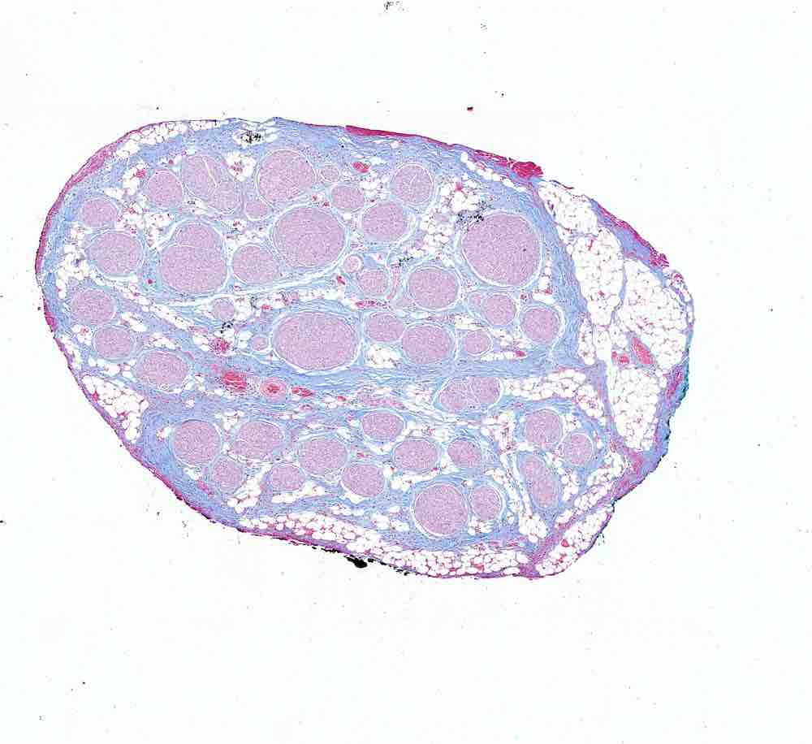
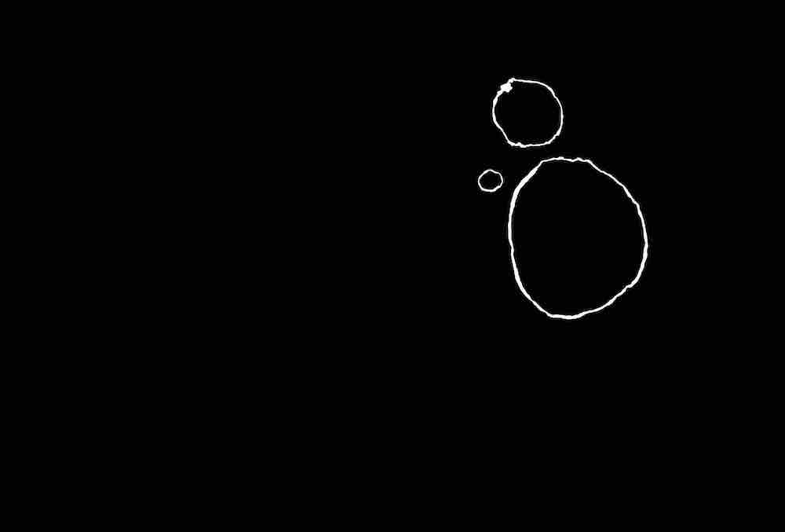
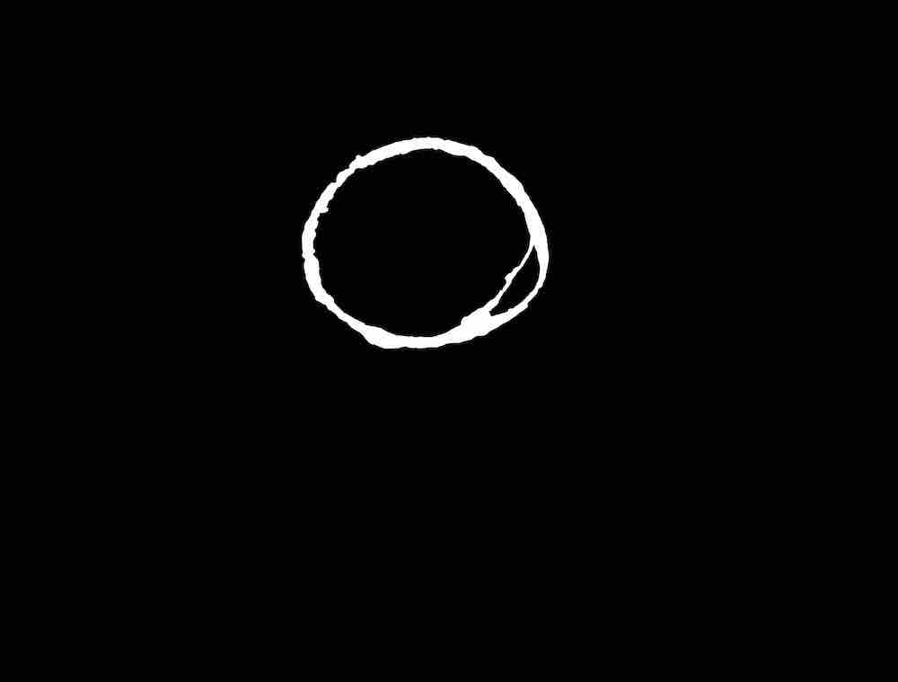
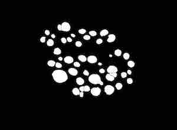
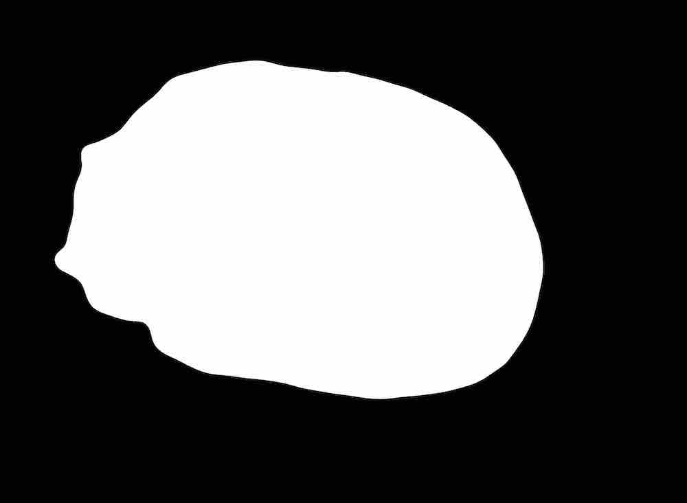

# SPARCpy

### Source files
The user must provide 3 types of files that will be used to construct the data filesystem. In addition to the type
designation (a single letter, seen in filename specifications below), 3 pieces of data must be included:

1. `[ARB_NAME]` – This is an arbitrary identifier at the beginning of each filename that will be _ignored_ by the
program; however, it is suggested that this consist of either the sample name or some other bookkeeping identifier as
determined on a case-by-case basis. Please note, that the **sample name** will be provided elsewhere in a more formal
manner.

2. `[CASSETTE]` – If a multi-slide sample is being analyzed, use a consistent system of uniquely identifying cassettes
used for embedding and slicing. In the (probably very common) cases that either one unnamed cassette was used or a
single-slide sample is being analyzed (via extrusion?), then default to a cassette name of "`0`". The essential aspect
of this naming system is that there be a **unique** and **consistent** identifier for each cassette.

3. `[NUMBER]` – For multi-slide samples, use a numbering system such that the linear order of samples is represented by
the order of numbers. In addition, the should be a unique slide for each cassette/number pairing. As with cassettes, 
default to the number "`0`" if numbering **within a sample** is not needed. Note that his does not pertain to the likely
scenario that individual samples have been numbered according to an arbitrary system; this information is not relevant
to SPARCpy and can thus be included in the **sample name** if desired.

Below is a description of the specific filename formatting for each of the 3 required file types. Note that, for all
formatting, there must be at least 1 underscore where indicated, but more than 1 is allowed and ignored. Each file type
description is accompanied by an example of what that image may look like

1. Raw image of slide
    - form: `[ARB_NAME]_[CASSETTE]_[NUMBER]_r.tif`
    - type: Though `.tif` is indicated above filename, this is arbitrary for now.
    - example:
    
        
2. Fascicles binary mask
    - form: `[ARB_NAME]_[CASSETTE]_[NUMBER]_f.tif`
    - type: Only `.tif` allowed for now.
    - examples (two options):
        - both inner (endoneurium) and outer (perineurium) masks,
          either one-to-one (top) or containing peanut fascicles (bottom)
          
        
          
        
          
        - only inner (endoneurium) masks if perineurium thickness is
          prohibitively small for the purposes of image segmentation
          
        
          
3. Nerve binary mask
    - form: `[ARB_NAME]_[CASSETTE]_[NUMBER]_n.tif`
    - type: Only `.tif` allowed for now.
    - example:
    