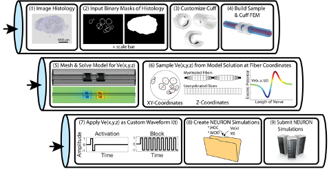

# 3 METHODS
## 3.1	Overview of the ASCENT Pipeline
The ASCENT pipeline automates the creation of finite element models (FEMs) using sample-specific nerve geometry and simulations of  multi-compartment cable models of axons to compute thresholds of activation and block (Figure 1). We simulate peripheral nerve stimulation by solving static electric fields (Bossetti et al., 2008) generated in inhomogeneous anisotropic nerve tissue, and then applying the extracellular potentials to cable models of individual fibers as a time-varying signal. 

Appendix A: Getting Started provides instructions to obtain the required software and package installations for the pipeline. The pipeline uses Python 3.7 (Van Rossum & Drake, 2009), Java SE Development Kit 8 (1.8) (Arnold et al., 2005), COMSOL Multiphysics 5.5 (COMSOL Inc., Burlington, MA), and NEURON v7.6 (Hines & Carnevale, 1997). Additionally, the pipeline uses Python packages: Pillow (Clark, 2020), NumPy (Oliphant, 2006), Shapely (Gillies, 2019), Matplotlib (Hunter, 2007), PyClipper (A. Johnson et al., 2019), pygame (Shinners, n.d.), QuantiPhy (Kundert, 2020), OpenCV (Bradski & Daebler, 2008), PyMunk (Blomqvist, 2019), and SciPy (Virtanen et al., 2020), pandas (The pandas development team, 2020), and OpenPyXL (Gazoni & Clark, 2020).

##### Figure 1. Overview of the ASCENT pipeline. The software automates the complex processes required to model accurately nerve response to electrical stimulation with custom cuff electrodes and waveforms.

### 3.1.1 Pipeline Data Hierarchy
Each execution of the ASCENT pipeline requires a “Run” JavaScript Object Notation (JSON) configuration file that contains indices for a user-defined set of JSON files. Specifically, a JSON file is defined for each hierarchical domain of information: (1) “Sample”: for processing segmented two-dimensional transverse cross-sectional geometry of a nerve sample, (2) “Model” (COMSOL parameters): for defining and solving three-dimensional FEM, including geometry of nerve, cuff, and medium, spatial discretization (i.e., mesh), materials, boundary conditions, and physics, and (3) “Sim” (NEURON parameters): for defining fiber models, stimulation waveforms, amplitudes, and durations, intracellular test pulses (for example, when seeking to determine block thresholds), parameters for binary search protocol and termination criteria for thresholds, and flags to save state variables. These configurations are organized hierarchically such that Sample does not depend on Model or Sim, and Model does not depend on Sim; thus, changes in Sim do not require changes in Model or Sample, and changes in Model do not require changes in Sample. Appendix B: JSON Configuration Files provides overviews of the JSON configuration files and their contents, and Appendix C: JSON File Parameter Guide details the syntax and data types of the key-value parameter pairs. Figure 2 illustrates the ASCENT pipeline organization, which logically follows the previously discussed hierarchical domains of information, as indicated by the distinct background colors for Sample, Model, and Sim. Appendix D: Python Super Classes describes Python utility classes that are inherited by many other functional classes throughout the pipeline to associate parameters stored in a JSON configuration file to a class instance (Configurable), to inherit a dictionary of system exceptions (Exceptionable), and to save a class as a Python object to file (Saveable). Box 2 contains an overview of the steps required for a user to operate the ASCENT pipeline after performing the initial setup described in Appendix A: Getting Started.

![Figure 2. ASCENT pipeline file structure in the context of Sample (blue), Model (green), and Sim (light purple) configurations. Note that the sample data hierarchy is capable of containing more than a single slide (the default being 0 as the cassette index and 0 as the section index, hence the 0\0 seen above), even though the pipeline data processing assumes that only a single slide exists. This choice was made to allow the current data hierarchy to be backwards compatible if multi-slide samples are processed in the future (e.g., connected via a “lofting” technique).](./figures/2.png)
##### Figure 2. ASCENT pipeline file structure in the context of Sample (blue), Model (green), and Sim (light purple) configurations. Note that the sample data hierarchy is capable of containing more than a single slide (the default being 0 as the cassette index and 0 as the section index, hence the 0\0 seen above), even though the pipeline data processing assumes that only a single slide exists. This choice was made to allow the current data hierarchy to be backwards compatible if multi-slide samples are processed in the future (e.g., connected via a “lofting” technique).

##### Box 2. How to run the ASCENT pipeline, after completing the initial setup defined in Appendix A: Getting Started.

The user provides binary mask inputs for the nerve and saves Sample, Model(s), and Sim(s) JSON configurations in directories* that are consistent with their indices defined in Run.

1. Masks: User populates input/\<NAME>/ with binary masks of neural tissue boundaries using either:
    - Segmented histology (following the naming convention in Appendix E: Morphology Files), or
    - Running the mock_morphology_generator.py script.
        1. Copy mock_sample.json from config/templates/ to config/user/mock_samples/ as \<mock_sample index>.json and update file contents, including the “NAME” parameter used to construct the destination path for the output binary masks.
        2. Call mock_morphology_generator.py \<mock_sample index>.
        3. The program saves a copy of the user’s mock_sample.json and binary masks in input/\<NAME>/.
2. For one Sample: User copies sample.json from config/templates/ to samples/\<sample index>/ as sample.json and edits its contents to define the processing of binary masks to generate the 2D cross-sectional geometry of the nerve in the FEM.
3. For each Model: User copies model.json from config/templates/ to samples/\<sample index>/models/\<model index>/ as model.json and edits its contents to define the 3D FEM.
    - Preset: User defines a new “preset” cuff JSON file, which contains instructions for creating their cuff electrode, and saves it as config/system/cuffs/\<preset_str>.json.
    - The <preset_str>.json file name must be assigned to the “preset” parameter in Model’s “cuff” JSON Object
4. For each Sim: User copies sim.json from config/templates/ to config/user/sims/ as \<sim index>.json and edits its contents to inform the NEURON simulations.
5. Run: User copies run.json from config/templates/ to config/user/runs/ as \<run index>.json and edits the indices for the created Sample, Model(s), and Sim(s) configurations.

The pipeline is run from the project path with the command “python start.py <run indices>”, where <run indices> is a list of space-separated Run indices (if multiple Sample indices, one Run for each). The pipeline outputs ready-to-submit NEURON simulations and associated Run file(s) to the “ASCENT_NSIM_EXPORT_PATH” directory as defined in config/system/env.json. NEURON simulations are run locally or submitted to a computer cluster with the command “./submit.py <run indices>”.
*directories are relative to the project path, defined in config/system/env.json

## 3.2 Nerve Morphology Input

The pipeline represents nerves in three dimensions by starting with a two-dimensional cross section of the nerve morphology, including the outer nerve trace (if multifascicular) and, for each fascicle, either a single “inner” perineurium trace or both “inner” and “outer” perineurium traces. Nerve sample morphology may be defined either with segmented histology (i.e., black and white binary image of the nerve and fascicles) or with a list of nerve dimensions and fascicle dimensions and locations. Two-dimensional cross sections of the nerve sample are then extruded into the third spatial dimension (i.e., the nerve in the COMSOL FEM has a constant cross-section) to compute the electric field generated along fibers within the nerve from an active cuff electrode. An important convention of the pipeline is that the nerve is always translated such that its centroid is at the origin (x,y,z) = (0,0,0) and then extruded in the positive (z)-direction in COMSOL.

### 3.2.1 Segmented Histology
To build the FEM with the morphology of a specific nerve sample, a micrograph of a histological cross section must be segmented to define the nerve and fascicular tissue areas as masks (Figure 3). Each mask must be binary (i.e., white pixels (‘1’) for the segmented tissue and black pixels (‘0’) elsewhere) and must use Tagged Image File Format (.tif, .tiff). All masks must be defined within the same field of view, be the same size, and be the same resolution. To convert between pixels of the input masks to dimensioned length (micrometers), a mask for the scale bar (s.tif) of known length must be provided (see “Scale Bar” in Figure 3) and the length of the scale bar must be indicated in Sample.

The available inputs to represent fascicle morphology may differ depending on the type of nerve sample and the contrast between tissue types that can be achieved in the histology. The user is required to set the MaskInputMode in Sample to communicate the contents of the segmented histology files (for details, see Appendix E: Morphology Files). Ideally, segmented images of boundaries for both the “outers” (o.tif) and “inners” (i.tif) of the perineurium will be provided, either as two separate files (o.tif and i.tif) or combined in the same image (c.tif) (see “Inners”, “Outers”, and “Combined” in Figure 3). However, if only inners are provided—which identify the outer edge of the endoneurium—a surrounding perineurium thickness is defined by the PerineuriumThicknessMode in Sample; the thickness is user-defined, possibly relating perineurium thickness to features of the inners (e.g., their diameter). However, it should be noted that defining nerve morphology with only inners does not allow the model to represent accurately fascicles containing multiple endoneurium inners within a single outer perineurium boundary (“peanut” fascicles; see red arrow for an example in Figure 3); in this case, each inner trace will be assumed to represent a single independent fascicle that does not share its perineurium with any other inners and more accurate representation requires segmentation of the “outers” as well.

The value of the PerineuriumThicknessMode in Sample refers to a JSON Object in config/system/ci_peri_thickness.json that contains coefficients for linear relationships between inner diameter and perineurium thickness (i.e., thkperi,inner = a*(diameterinner) + b). In ci_peri_thickness.json, we provided mode “GRINBERG_2008” which defines perineurium thickness as 3% of inner diameter based on existing literature (Grinberg et al., 2008). As additional vagus nerve morphometry data become available, users may define perineurium thickness with new models by adding the coefficients for the model to this JSON.

The outer nerve boundary, if present, is defined with a separate mask (n.tif). In the case of a compound nerve with multiple fascicles (see Figure 3), the pipeline expects the outer boundary of the epineurium to be provided as the “nerve.” In the case of a nerve with a single fascicle, no nerve mask is required—in which case either the outer perineurium boundary (if present) or the inner perineurium boundary (otherwise) is used as the nerve boundary—although one may be provided if epineurium or other tissue that would be within the cuff is present in the sample histology.

Lastly, an “orientation” mask (a.tif) can be optionally defined. This mask should be all black except for a small portion that is white, representing the relative position to which the rotational center of the cuff must be rotated. We define the rotational center of a cuff as the angle of the coordinate halfway along the arc length of the electrode contact while the circular portion of a cuff’s diameter is centered at the origin (“angle_to_contacts_deg” in a preset cuff’s JSON file). If this mask is provided, other cuff rotation methods are overridden, and the location of the white portion is defined as 0°.

The morphology masks must be saved into the directory input/\<NAME>/ in a directory following the naming convention described in Appendix E: Morphology Files. The user must define the MaskInputMode in Sample to indicate which set of input masks will be used.

![Figure 3. Human cervical vagus nerve sample histology stained selectively for perineurium. Using Nikon’s NIS-Elements software, we segmented the nerve boundary and the perineurium. Segmented histology inputs to the pipeline require separate binary images for the “Nerve” (n.tif, if present), the perineurium (either “Combined” (c.tif), or both “Inners” (i.tif) and “Outers” (o.tif)), and a “Scale Bar” (s.tif) of known length, where the length is defined in Sample. Red arrows highlight the ends of the scale bar, which is just a line of white pixels.](./figures/3.png)
##### Figure 3. Human cervical vagus nerve sample histology stained selectively for perineurium. Using Nikon’s NIS-Elements software, we segmented the nerve boundary and the perineurium. Segmented histology inputs to the pipeline require separate binary images for the “Nerve” (n.tif, if present), the perineurium (either “Combined” (c.tif), or both “Inners” (i.tif) and “Outers” (o.tif)), and a “Scale Bar” (s.tif) of known length, where the length is defined in Sample. Red arrows highlight the ends of the scale bar, which is just a line of white pixels.

### 3.2.2 Mock Nerve Morphology Generator
As an alternative to segmented histology, users can define a sample morphology as a list of elliptical fascicles (i.e., centroid coordinates, lengths of the major and minor axes, and rotation) and nerve, and the mock_morphology_generator.py script enables the user to define morphology of a new sample either explicitly or probabilistically. The user may populate an elliptical nerve using either the explicit option for which the sizes, locations, and rotations of fascicles are explicitly defined by the user, or a probabilistic option that randomly places elliptical fascicles within the nerve with diameters and eccentricities from a statistical distribution (e.g., truncated normal, uniform) using randomly chosen centroids and rotations. The pipeline ensures that the fascicles have the minimum defined space between each fascicle boundary and the nerve and between fascicle boundaries. For details on the parameters that define sample morphology using our mock nerve morphology generator, see Appendix B: JSON Configuration Files for a description of mock_sample.json and Appendix C: JSON File Parameter Guide for details of the syntax/data type of the key-value parameter pairs required to define a mock sample.

The user defines the parameter values in config/user/mock_samples/\<mock_sample index>.json. (with a template provided in config/templates/mock_sample.json). The mock sample morphology is then created using the JSON file by executing mock_morphology_generator.py at the project root with the argument of \<mock_sample index> (e.g., 0, 1 ...). The morphology generator uses the MockSample Python class (Appendix F: Python MockSample Class for Creating Binary Masks of Nerve Morphology) to create binary images of the nerve, inner perineurium traces (fascicles), and the scale bar in input/\<NAME>/ following the standard naming convention (Appendix E: Morphology Files), which allow the pipeline to function as if binary images of segmented histology were provided. The \<mock_sample index>.json file and the resulting segmented nerve morphology files are automatically saved in input/\<NAME>/. 

### 3.2.3	Python Classes for Representing Nerve Morphology
We developed a standardized object-oriented framework for representing nerve morphology that enables the user to avoid complex operations. The pipeline’s Python classes for representing tissue boundaries contain progressively increasing scope: Trace, Nerve, Fascicle, Slide, Map, and Sample (see details in Appendix G: Python Classes for Representing Nerve Morphology (Sample)).

#### 3.2.3.1	Trace
Trace is the core Python class for handling a list of points that define a closed loop for a tissue boundary in a nerve cross section (see “Tissue Boundaries” in Figure 3). Trace has built-in functionality for transforming, reporting, displaying, saving, and performing calculations on its data contents and properties. Python classes Nerve, Fascicle, and Slide, at their core, are all special instances or hierarchical collections of the Trace class. 
#### 3.2.3.2 Nerve
Nerve is the name of a special instance of Trace reserved for representing the outer nerve (epineurium) boundary of a compound nerve. An instance of the Nerve class is created if the NerveMode in Sample is “PRESENT”.

#### 3.2.3.3 Fascicle
Fascicle is a class that bundles together instance(s) of the Trace class to represent a single fascicle in a slide. The Fascicle class can be defined with either (1) an instance of Trace representing an outer perineurium trace and one or more instances of Trace representing inner perineurium traces, or (2) an inner perineurium trace that is subsequently scaled to make a virtual outer using Trace’s methods deepcopy() and offset() and the perineurium thickness defined by the PerineuriumThicknessMode in Sample. Upon instantiation, the Fascicle class automatically performs self-validation to ensure that each inner instance of Trace is fully within its outer instance of Trace and that no inner instance of Trace intersects another inner instance of Trace.

#### 3.2.3.4 Slide
The Slide class represents the morphology of a single transverse cross section of a nerve sample (i.e., nerve and fascicle boundaries). The Slide allows operations such as translation and plotting to be performed on all Nerve and Fascicle Traces that define a sample.

#### 3.2.3.5 Map
Map is a Python class used to keep track of the relationship of the longitudinal position of all Slide instances for a Sample class. At present, the pipeline only supports making models of nerves with constant cross-sectional area, meaning only one Slide is used per FEM, but this class is implemented for future expansion of the pipeline to construct three-dimensional nerve models with varying cross-section (e.g., using serial histological sections). If only one slide is provided, Map is generated automatically, and the user should have little need to interact with this class if maintaining the 1:1 sample to slide ratio.

#### 3.2.3.6 Sample
The Sample class is initialized within Runner’s run() method by loading Sample and Run configurations. First, Sample’s build_file_structure() method creates directories in samples/ and populates them with the user’s file inputs from input/<NAME>/; the images are copied over for subsequent processing, as well as for convenience in creating summary figures. Sample then uses its populate() method to construct instances of Nerve and Fascicle classes in memory from the input sample morphology binary images (see Fascicle class in Appendix G: Python Classes for Representing Nerve Morphology (Sample) for details). Sample’s populate() method packages instances of Nerve and Fascicle(s) into an instance of Slide.

We created a Deformable class which deforms a Slide based on the DeformationMode in Sample (e.g., NONE, PHYSICS). If DeformationMode is set to NONE, then the Deformable class takes no action. However, if DeformationMode is set to PHYSICS, then Deformable’s deform() method simulates the change in nerve cross section that occurs when a nerve is placed in a cuff electrode. Specifically, the outer boundary of a Slide’s Nerve mask is transformed into a user-defined final geometry based on the ReshapeNerveMode in Sample (e.g., CIRCLE) while maintaining the cross-sectional area. Meanwhile, the fascicles (i.e., outers) are repositioned within the new nerve cross section in a physics-based way in which each fascicle is treated as rigid body with no elasticity as it is slowly “pushed” into place by both surrounding fascicles and the nerve boundary (Figure 4). For further details on the deform() method, see “Deformable” in Appendix G: Python Classes for Representing Nerve Morphology (Sample).

![Figure 4. Snapshots at 0%, 50%, and 100% (left-to-right) of the deformation process powered by the pygame package. The deformation process is shown for two different minimum fascicle separation constraints: 10 µm (top row) and 20 µm (bottom row). This figure was built by using the optional flag “deform_ratio” in Sample (set to floating-point value between 0.0 and 1.0, inclusive), then plotting each sample after processing has occurred (i.e., not within the main line of execution of the pipeline). Note that enforcing a minimum fascicle separation that is extremely large (e.g., 20 µm) can cause inaccurate deformation, as fascicles may be unable to satisfy both minimum separation constraints and nerve boundary constraints. The geometry at 0% deformation is shown after the fascicles have been spread out to the minimum separation constraint.](./figures/4.png)
##### Figure 4. Snapshots at 0%, 50%, and 100% (left-to-right) of the deformation process powered by the pygame package. The deformation process is shown for two different minimum fascicle separation constraints: 10 µm (top row) and 20 µm (bottom row). This figure was built by using the optional flag “deform_ratio” in Sample (set to floating-point value between 0.0 and 1.0, inclusive), then plotting each sample after processing has occurred (i.e., not within the main line of execution of the pipeline). Note that enforcing a minimum fascicle separation that is extremely large (e.g., 20 µm) can cause inaccurate deformation, as fascicles may be unable to satisfy both minimum separation constraints and nerve boundary constraints. The geometry at 0% deformation is shown after the fascicles have been spread out to the minimum separation constraint.

The Python Sample class includes the output_morphology_data() method, which writes the area and best-fit ellipse metrics (centroid, major and minor axes, rotational orientation) of the nerve and fascicle(s) (outer and inners) to Sample.

We automated the process by which sample-specific three-dimensional nerves are modeled in COMSOL. Our process uses CAD sectionwise files (i.e., ASCII with .txt extension containing column vectors for x- and y-coordinates) created by the Python Sample class prior to handoff() to define tissue boundaries of the nerve cross section in COMSOL. For additional details on how sample-specific nerve morphologies are represented in COMSOL, see Appendix H: Creating Sample-Specific Nerve Morphologies in COMSOL.

