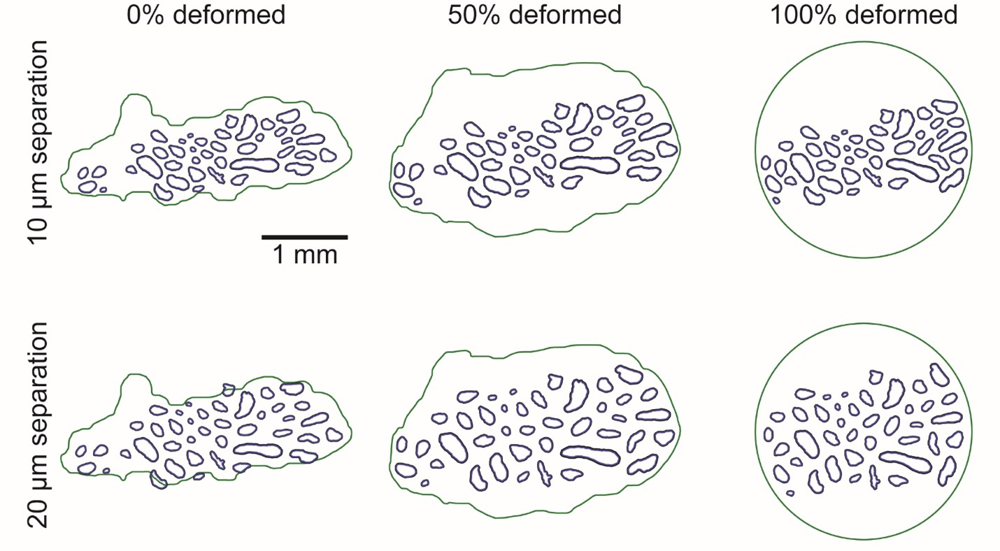

# Python Classes
## Python classes for representing nerve morphology (Sample)
The nerve cross section includes the outer nerve trace (if present; not
required for monofascicular nerves) and, for each fascicle, either a
single “inner” perineurium trace or both “inner” and “outer” perineurium
traces. We provide automated control to correct for tissue shrinkage
during histological processes {cite:p}`Boyd1979` ([S8 Text](S8-JSON-file-parameter-guide)). Morphology metrics (e.g., nerve
and fascicle(s) cross-sectional areas and centroids, major and minor
axis lengths, and rotations of the best-fit ellipses) are automatically
reported in ***Sample*** ([S8 Text](S8-JSON-file-parameter-guide)).

###  Trace

Trace is the core Python class for handling a list of points that define
a closed loop for a tissue boundary in a nerve cross section (see
“Tissue Boundaries” in [Fig 2](https://doi.org/10.1371/journal.pcbi.1009285.g002)). Trace has built-in functionality for
transforming, reporting, displaying, saving, and performing calculations
on its data contents and properties. Python classes Nerve, Fascicle, and
Slide are all special instances or hierarchical collections of Trace.

A Trace requires inputs of a set of (x,y)-points that define a closed
loop and an exceptions JSON configuration file. The z-points are assumed
to be ‘0’. The Trace class already provides many built-in
functionalities, but any further user-desired methods needed either to
mutate or access nerve morphology should be added to the Trace class.

Trace uses the *OpenCV* {cite:p}`opencv_library`, *Pyclipper* {cite:p}`pyclipper2015`, and *Shapely* {cite:p}`shapely2007` Python packages to
support modifier methods (e.g., for performing transformations):

  - `scale()`: Used to assign dimensional units to points and to correct
    for shrinkage of nerve tissues during processing of histology.

  - `rotate()`: Performs a rigid rotational transformation of Trace about
    a point (positive angles are counter-clockwise and negative are
    clockwise).

  - `shift()`: performs a 2D translational shift to Trace (in the
    (x,y)-plane, i.e., the sample cross section).

  - `offset()`: Offsets Trace’s boundary by a discrete distance from the
    existing Trace boundary (non-affine transformation in the
    (x,y)-plane, i.e., the sample cross section).

  - `pymunk_poly()`: Uses *Pymunk* to create a body with mass and inertia
    for a given Trace boundary (used in `deform()`, the fascicle
    repositioning method, from the Deformable class).

  - `pymunk_segments()`: Uses *Pymunk* to create a static body for
    representing intermediate nerve boundaries (used in `deform()`, the
    fascicle repositioning method, from the Deformable class).

Trace also contains accessor methods:

  - `within()`: Returns a Boolean indicating if a Trace is completely
    within another Trace.

  - `intersects()`: Returns a Boolean indicating if a Trace is
    intersecting another Trace.

  - `centroid()`: Returns the centroid of the best fit ellipse of Trace.

  - `area()`: Returns the cross-sectional area of Trace.

  - `random_points()`: Returns a random list of coordinates within the
    Trace (used to define axon locations within the Trace).

Lastly, Trace has a few utility methods:

  - `plot()`: Plots the Trace using formatting options (i.e., using the
    `plt.plot` format, see [Matplotlib
    documentation](https://matplotlib.org/contents.html)
    for details).

  - `deepcopy()`: Fully copy an instance of Trace (i.e., copy data, not
    just a reference/pointer to original instance).

  - `write()`: Writes the Trace data to the provided file format
    (currently, only COMSOL’s
    [sectionwise](https://www.comsol.com/fileformats) format
    —ASCII with .txt extension
    containing column vectors for x- and y-coordinates—is supported).

###  Nerve

Nerve is the name of a special instance of Trace reserved for
representing the outer nerve (epineurium) boundary. It functions as an
alias for Trace. An instance of the Nerve class is created if the
`“NerveMode”` in ***Sample*** (“nerve”) is “PRESENT” ([S8 Text](S8-JSON-file-parameter-guide))"

###  Fascicle

Fascicle is a class that bundles together instance(s) of Trace to
represent a single fascicle in a slide. Fascicle can be defined with
either (1) an instance of Trace representing an outer perineurium trace
and one or more instances of Trace representing inner perineurium
traces, or (2) an inner perineurium trace that is subsequently scaled to
make a virtual outer using Trace’s methods `deepcopy()` and `offset()` and
the perineurium thickness defined by the `“PerineuriumThicknessMode”` in
***Sample*** (`“ci_perineurium_thickness”`) ([S8 Text](S8-JSON-file-parameter-guide)). Upon instantiation,
Fascicle automatically validates that each inner instance of Trace is
fully within its outer instance of Trace and that no inner instance of
Trace intersects another inner instance of Trace.

Fascicle contains methods for converting a binary mask image of
segmented fascicles into instances of the Fascicle class. The method
used depends on the contents of the binary image inputs to the pipeline
as indicated by the `“MaskInputMode”` in ***Sample*** (`“mask_input”`)
(i.e., `INNER_AND_OUTER_SEPARATE`, `INNER_AND_OUTER_COMPILED`, or
`INNERS`). For each of the mask-to-Fascicle conversion methods, the OpenCV
Python package finds material boundaries and reports their nested
hierarchy (i.e., which inner Traces are within which outer Traces,
thereby associating each outer with one or more inners). The methods are
expecting a *maximum* hierarchical level of 2: one level for inners and
one level for outers.

  - If separate binary images were provided containing contours for
    inners (`i.tif`) and outers (`o.tif`), then the `“MaskInputMode”` in
    ***Sample*** (`“mask_input”`, [S8 Text](S8-JSON-file-parameter-guide)) is `INNER_AND_OUTER_SEPARATE`.

  - If a single binary image was provided containing combined contours
    of inners and outers (`c.tif`), then the `“MaskInputMode”` in
    ***Sample*** (`“mask_input”`, [S8 Text](S8-JSON-file-parameter-guide)) is `INNER_AND_OUTER_COMPILED`.

  - If only a binary image was provided for contours of inners (`i.tif`),
    the `“MaskInputMode”` (`“mask_input”`, [S8 Text](S8-JSON-file-parameter-guide)) in ***Sample*** is `INNERS`.

In all cases, the Fascicle class uses its `to_list()` method to generate the appropriate
Traces. Additionally, Fascicle has a `write()` method which saves a Fascicle’s
inner (one or many) and outer Traces to files that later serve as inputs
for COMSOL to define material boundaries in a nerve cross section
([sectionwise file format](https://www.comsol.com/fileformats)
, i.e., ASCII with `.txt` extension
containing column vectors for x- and y-coordinates). Lastly, Fascicle
has a `morphology_data()` method which uses Trace’s `area()` and `ellipse()`
methods to return the area and the best-fit ellipse centroid, axes, and
rotation of each outer and inner as a JSON Object to ***Sample*** ([S8 Text](S8-JSON-file-parameter-guide)).

###  Slide

The Slide class represents the morphology of a single transverse cross
section of a nerve sample (i.e., nerve and fascicle boundaries). An
important convention of the pipeline is that the nerve is always
translated such that its centroid (i.e., from best-fit ellipse) is at
the origin (x,y,z) = (0,0,0) and then extruded in the positive
(z)-direction in COMSOL. Slide allows operations such as translation and
plotting to be performed on all Nerve and Fascicle Traces that define a
sample collectively.

To create an instance of the Slide class, the following items must be
defined:

  - A list of instance(s) of the Fascicle class.

  - `“NerveMode”` from ***Sample*** (“nerve”) (i.e., `PRESENT` as in the
    case of nerves with epineurium (`n.tif`) or `NOT_PRESENT` otherwise, ([S8 Text](S8-JSON-file-parameter-guide))).

  - An instance of the Nerve class if `"NerveMode"` is `PRESENT`.

  - A Boolean for whether to reposition fascicles within the
    nerve from `“ReshapeNerveMode”` in ***Sample*** ([S8 Text](S8-JSON-file-parameter-guide)).

  - A list of exceptions.

The Slide class validates, manipulates, and writes its contents.

  - In Slide’s `validation()` method, Slide returns a Boolean indicating
    if its Fascicles and Nerve Traces are overlapping or too close to
    one another (based on the minimum fascicle separation parameter in
    ***Sample***).

<!-- end list -->

  - In Slide’s `smooth_traces()` method, Slide applies a smooth operation to each Trace
    in the slide, leveraging the offset method, and applying smoothing based on
    `smoothing` parameters. defined in ***Sample*** ([S8 Text](S8-JSON-file-parameter-guide)).

  - In Slide’s `move_center()` method, Slide repositions its contents
    about a central coordinate using Trace’s `shift()` method available to
    both the Nerve and Fascicle classes (by convention, in ASCENT this
    is (x,y) = (0,0)).

  - In Slide’s `reshaped_nerve()` method, Slide returns the deformed
    boundary of Nerve based on the `“ReshapeNerveMode”` in ***Sample***
    (`“reshape_nerve”`, ([S8 Text](S8-JSON-file-parameter-guide))) (e.g., CIRCLE).

  - Using the methods of Nerve and Fascicle, which are both
    manifestations of Trace, Slide has its own methods `plot()`, `scale()`,
    and `rotate()`.

  - Slide has its own `write()` method which determines the file structure
    to which the Trace contours are saved to file in `samples/<sample
    index>/slides/`.

*Note that the sample data hierarchy can contain more than
a single Slide instance (the default being 0 as the cassette index and 0
as the section index, hence the 0/0 seen in [S3 Text](S3-ASCENT-data-hierarchy) Figure A) even though
the pipeline data processing assumes that only a single Slide exists.
This will allow the current data hierarchy to be backwards compatible if
multi-Slide samples are processed in the future.*

###  Map

Map is a Python class used to keep track of the relationship of the
longitudinal position of all Slide instances for a Sample class. At
present, the pipeline only supports models of nerves with constant
cross-sectional area, meaning only one Slide is used per FEM, but this
class is implemented for future expansion of the pipeline to construct
three-dimensional nerve models with varying cross section (e.g., using
serial histological sections). If only one slide is provided, Map is
generated automatically, and the user should have little need to
interact with this class.

###  Sample

The Sample class is initialized within Runner’s `run()` method by loading
***Sample*** and ***Run*** configurations ([S7](S7-JSON-configuration-files) and [S8](S8-JSON-file-parameter-guide) Text). First, Sample’s
`build_file_structure()` method creates directories in `samples/` and
populates them with the user’s file inputs from `input/<NAME>/;` the
images are copied over for subsequent processing, as well as for
convenience in creating summary figures. Sample then uses its `populate()`
method to construct instances of Nerve and Fascicle in memory from the
input sample morphology binary images (see Fascicle class above for
details). Sample’s `populate()` method packages instances of Nerve and
Fascicle(s) into an instance of Slide.

Sample's `get_factor()` method obtains the ratio of microns/pixel for the input masks,
either utilizing a scale bar image, or an explicit scale factor input depending on
the user's `ScaleInputMode` defined in ***Sample*** ([S8 Text](S8-JSON-file-parameter-guide)).

Sample’s `scale()` method is used to convert Trace points from pixel
coordinates to coordinates with units of distance based either on the length of
the horizontal scale bar as defined in ***Sample*** (micrometers) and
the width of the scale bar (pixels) in the input binary image (`s.tif`), or on the explicitly specified scale ratio defined in ***Sample*** ([S8 Text](S8-JSON-file-parameter-guide)).
If using a scale bar for scale input, it must be a perfectly horizontal line. Sample’s scale()
method is also used within `populate()` to correct for shrinkage that may
have occurred during the histological tissue processing. The percentage
increase for shrinkage correction in the slide's 2D geometry is stored
as a parameter “shrinkage” in ***Sample*** ([S8 Text](S8-JSON-file-parameter-guide)). Additionally, Slide has a
`move_center()` method which is used to center Slide about a point within
`populate()`. Note that Sample is centered with the centroid of the
best-fit ellipse of the outermost Trace (Nerve if `“NerveMode”` in
***Sample*** (“nerve”) is `“PRESENT”`, outer Trace if `“NerveMode”` is
`“NOT_PRESENT”`, ([S8 Text](S8-JSON-file-parameter-guide))) at the origin (0,0,0). Change in rotational or
translational placement of the cuff around the nerve is accomplished by
moving the cuff and keeping the nerve position fixed ([S19 Text](S19-Cuff-placement-on-nerve)).

Sample's `im_preprocess()` method performs preprocessing operations on the binary input
masks based on the parameters given under `preprocess` in ***Sample*** ([S8 Text](S8-JSON-file-parameter-guide)).

Sample's `io_from_compiled()` generates outers (o.tif) and inners (i.tif) from the
(compiled) c.tif mask if `"MaskInputMode"` is `INNER_AND_OUTER_COMPILED`. These generated
masks are then used in Fascicle's `to_list()` method.

Sample's `generate_perineurium()` method is used to generate the perineurium for fascicle
inners in the case where `"MaskInputMode"` = `INNERS`. This leverages Trace's `offset()`
method, and fits the generated perineurium based on `ci_perineurium_thickness` defined in
***Sample*** ([S8 Text](S8-JSON-file-parameter-guide)).

Sample’s `populate()` method also manages operations for saving tissue
boundaries of the Sample (Nerve and Fascicles) to CAD files
(`slides/#/#/sectionwise2d/`) for input to COMSOL with Sample’s
`write()` method.

Sample’s `output_morphology_data()` method collects sample morphology
information (area, and the best-fit ellipse information: centroid, major
axis, minor axis, and rotation) for each original Trace (i.e., Fascicle
inners and outers, and Nerve) and saves the data under “Morphology” in
***Sample.***

Lastly, since Sample inherits `Saveable`, Sample has access to the `save()`
method which saves the Python object to file.

###  Deformable

If `“DeformationMode”` in ***Sample*** (“deform”) is set to `NONE`, then the
Deformable class takes no action ([S8 Text](S8-JSON-file-parameter-guide)). However, if `“DeformationMode”` in
***Sample*** is set to `PHYSICS`, then Deformable’s `deform()` method
simulates the change in nerve cross section that occurs when a nerve is
placed in a cuff electrode. Specifically, the outer boundary of a
Slide’s Nerve mask is transformed into a user-defined final geometry
based on the `“ReshapeNerveMode”` in ***Sample*** (i.e., `CIRCLE`) while
maintaining the cross-sectional area. Meanwhile, the fascicles (i.e.,
outers) are repositioned within the new nerve cross section in a
physics-based way using Pymunk {cite:p}`pymunk`, a 2D physics library, in which
each fascicle is treated as rigid body with no elasticity as it is
slowly “pushed” into place by both surrounding fascicles and the nerve
boundary (Figure A).



Figure A. Snapshots at 0%, 50%, and 100% (left-to-right) of the deformation process powered by the pygame package {cite:p}`pygame2011`. The deformation process is shown for two minimum fascicle separation constraints: 10 µm (top row) and 20 µm (bottom row). The geometry at 0% deformation is shown after the fascicles have been spread out to the minimum separation constraint.

The `deform()` method updates the nerve boundary to
intermediately-deformed nerve traces between the nerve’s
`“boundary_start”` (i.e., the Trace’s profile in segmented image) and
`“boundary_end”` (i.e., the Trace’s profile after accommodation to the
cuff’s inner diameter, which is determined by the “ReshapeNerveMode”
(`“reshape_nerve”`, [S8 Text](S8-JSON-file-parameter-guide)) while the fascicle contents are allowed to
rearrange in a physics-space. By default, all fascicles have the same
“mass”, but their moment of inertia is calculated for each fascicle
based on its geometry (see Trace’s `pymunk_poly()` method). Each fascicle
is also assigned a “friction coefficient” of 0.5 as well as a “density”
of 0.01. These measurements are mostly important as they relate to one
another, not as absolute values. Importantly, we set the elasticity of
all the fascicles to 0, so all kinetic energy is absorbed, and fascicles
only move if they are directly pushed by another fascicle or by the
nerve barrier. In Sample’s `populate()` method, the final fascicle
locations and rotations returned by the `deform()` method are then applied
to each fascicle using the Fascicle class’s `shift()` and `rotate()`
methods.

Deformable’s convenience constructor, `from_slide()`, is automatically
called in Sample’s `populate()` method, where a Slide is deformed to user
specification. The `from_slide()` method takes three input arguments: The
Slide object from which to construct the current Deformable object, the
`“ReshapeNerveMode”` (e.g., CIRCLE, [S8 Text](S8-JSON-file-parameter-guide)), and the minimum distance between
fascicles. If only inners are provided, virtual outers interact during
nerve deformation to account for the thickness of the perineurium. Each
inner’s perineurium thickness is defined by the
`“PerineuriumThicknessMode”` in ***Sample***
(`“ci_perineurium_thickness”`, [S8 Text](S8-JSON-file-parameter-guide)), which specifies the linear
relationship between inner diameter and perineurium thickness defined in
`config/system/ci_peri_thickness.json` ([S8 Text](S8-JSON-file-parameter-guide)). Deformable’s
`from_slide()` method uses Deformable’s `deform_steps()` method to
calculate the intermediately-deformed nerve traces between the
`boundary_start` and the `boundary_end`, which contain the same number of
points and maintain nerve cross-sectional area. The `deform_steps()`
method maps points between `boundary_start` and `boundary_end` in the
following manner. Starting from the two points where the major axis of
the Nerve’s best-fit ellipse intersects `boundary_start` and
`boundary_end`, the algorithm matches consecutive `boundary_start` and
`boundary_end` points and calculates the vectors between all point pairs.
The `deform_steps()` method then returns a list of
intermediately-deformed nerve traces between the `boundary_start` and
`boundary_end` by adding linearly-spaced portions of each point pair’s
vector to `boundary_start`. Also note that by defining `“deform_ratio”`
(value between 0 and 1) in ***Sample***, the user can optionally
indicate a partial deformation of the Nerve ([S8 Text](S8-JSON-file-parameter-guide)).
In the case where `"deform_ratio"` is set to 0, minimum fascicle separation will still be
enforced, but no changes to the nerve boundary will occur.

Enforcing a minimum fascicle separation that is extremely large (e.g.,
20 µm) can cause inaccurate deformation, as fascicles may be unable to
satisfy both minimum separation constraints and nerve boundary
constraints.

To maintain a minimum distance between adjacent fascicles, the
Deformable’s `deform()` method uses Trace’s `offset()` method to perform a
non-affine scaling out of the fascicle boundaries by a fixed distance
before defining the fascicles as rigid bodies in the `pygame` physics
space. At regular intervals in physics simulation time, the nerve
boundary is updated to the next Trace in the list of
intermediately-deformed nerve traces created by `deform_steps()`. This
number of Trace steps defaults to 36 but can be optionally set in
***Sample*** with the `“morph_count”` parameter by the user ([S8 Text](S8-JSON-file-parameter-guide)). It is
important to note that too few Trace steps can result in fascicles lying
outside of the nerve during deformation, while too many Trace steps can
be unnecessarily time intensive. We’ve set the default to 36 because it
tends to minimize both aforementioned issues for all sample sizes
and types that we have tested.

The user may also visualize nerve deformation by setting the
`“deform_animate”` argument to true in `sample.populate()` (called in
Runner’s `run()` method) ([S8 Text](S8-JSON-file-parameter-guide)). Visualizing sample deformation can be helpful
for debugging but increases computational load and slows down the
deformation process significantly. When performing deformation on many
slides, we advise setting this flag to false.

### References
1. Boyd IA, Kalu KU. Scaling factor relating conduction velocity and diameter for myelinated afferent  nerve fibres in the cat hind limb. J Physiol. 1979 Apr;289:277–97. Available from: [https://doi.org/10.1113/jphysiol.1979.sp012737](https://doi.org/10.1113/jphysiol.1979.sp012737)
2. 	Bradski G, Daebler A. Learning OpenCV. Computer vision with OpenCV library. 2008 Jan 1;222–64.
3. 	Johnson A, Chalton M, Treyer L, Ratajc G. pyclipper · PyPI [Internet]. 2019 [cited 2020 Apr 20]. Available from: [https://pypi.org/project/pyclipper/](https://pypi.org/project/pyclipper/)
4. 	Gillies S. Shapely · PyPI [Internet]. 2019 [cited 2020 Apr 20]. Available from: [https://pypi.org/project/Shapely/](https://pypi.org/project/Shapely/)
5. 	Blomqvist V. pymunk · PyPI [Internet]. 2019 [cited 2020 Apr 20]. Available from: [https://pypi.org/project/pymunk/](https://pypi.org/project/pymunk/)
6. 	Shinners P. Pygame Intro — pygame v2.0.0.dev5 documentation [Internet]. [cited 2020 Apr 20]. Available from: [https://www.pygame.org/docs/tut/PygameIntro.html](https://www.pygame.org/docs/tut/PygameIntro.html)

## Simulation
###  (Pre-Java)

The user is unlikely to interface directly with Simulation’s
`resolve_factors()` method as it operates behind the scenes. The method
searches through ***Sim*** for lists of parameters within the “fibers”
and “waveform” JSON Objects until the indicated number of dimensions
(“n_dimensions” parameter in ***Sim***, which is a handshake to
prevent erroneous generation of NEURON simulations) has been reached.
The parameters over which the user has indicated to sweep in ***Sim***
are saved to the Simulation class as a dictionary named “factors” with
the path to each parameter in ***Sim***.

The required parameters to define each type of waveform are in [S8 Text](S8-JSON-file-parameter-guide). The Python Waveform class is configured with ***Sim***, which contains
all parameters that define the Waveform. Since FEMs may have
frequency-dependent conductivities, the parameter for frequency of
stimulation is optionally defined in ***Model*** (for frequency-dependent
material conductivities), but the pulse repetition frequency is
defined in ***Sim*** as `“pulse_repetition_freq”`. The
`write_waveforms()` method instantiates a Python Waveform class for each
`“wave_set”` (i.e., one combination of stimulation parameters).

###  (Post-Java)

The unique combinations of ***Sim*** parameters are found with a
Cartesian product from the listed values for individual parameters in
***Sim***: Waveforms ⨉ Src_weights ⨉ Fibersets. The pipeline manages
the indexing of simulations. For ease of debugging and inspection, into
each `n_sim/` directory we copy in a modified “reduced” version of
***Sim*** with any lists of parameters replaced by the single list
element value investigated in the particular `n_sim/` directory.

The Simulation class loops over ***Model*** and ***Sim*** as listed in
***Run*** and loads the Python `“sim.obj”` object saved in each simulation
directory `(sims/\<sim index\>/)` prior to Python’s `handoff()` to Java.
Using the Python object for the simulation loaded into memory, the
Simulation class’s method `build_n_sims()` loops over the
`master_product_index` (i.e., waveforms ⨉ (src_weights ⨉ fibersets)).
For each `master_product_index`, the program creates the `n_sim` file
structure (```sims/<sim index>/n_sims/<n_sim index>/data/inputs/``` and
```sims/<sim index>/n_sims/<n_sim index>/data/outputs/```).
Corresponding to the `n_sim’s` `master_product_index`, files are copied
into the `n_sim` directory for a “reduced” ***Sim***, stimulation
waveform, and fiber potentials. Additionally, the program writes a HOC
file (i.e., `“launch.hoc”`) containing parameters for and a call to our
`Wrapper.hoc` file using the Python `HocWriter` class.

To conveniently submit the `n\_sim` directories to a computer cluster, we
created methods within Simulation named `export_n_sims()`,
`export_run()`, and `export_neuron_files()`. The method `export_n_sims()`
copies `n_sims` from our native hierarchical file structure to a target
directory as defined in the system `env.json` config file by the value for
the `“ASCENT_NSIM_EXPORT_PATH”` key. Within the target directory, a
directory named `n_sims/` contains all `n_sims`. Each `n_sim` is renamed
corresponding to its sample, model, sim, and `master_product_index`
(`<sample_index>_<model_index>_<sim_index>_<master_product_index>`)
and is therefore unique. Analogously, `export_run()` creates a copy of
***Run*** within the target directory in a directory named `runs/`. Lastly,
`export_neuron_files()` is used to create a copy of the NEURON `*.hoc`
and `*.mod` files in the target directory in directories named
`“HOC_Files”` and `“MOD_Files”`, respectively.

## Fiberset
Runner’s `run()` method first loads JSON configuration files for
***Sample***, ***Model***, and ***Sim*** into memory and instantiates a
Python Sample class. The Sample instance produces two-dimensional CAD
files that define nerve and fascicle tissue boundaries in COMSOL from
the input binary masks. The `run()` method also instantiates Python
Simulation classes using the ***Model*** and ***Sim*** configurations to
define the coordinates of “fibersets” where “potentials” are sampled in
COMSOL to be applied extracellularly in NEURON and to define the current
amplitude versus time stimulation waveform used in NEURON (“waveforms”).
The Simulation class is unique in that it performs operations both
before and after the program performs a handoff to Java for COMSOL
operations. Before the handoff to Java, each Simulation writes
`fibersets/` and `waveforms/` to file, and after the Java operations
are complete, each Simulation builds folders (i.e., `n_sims/`), each
containing NEURON code and input data for simulating fiber responses for
a single ***Sample***, ***Model***, fiberset, waveform, and contact
weighting. Each instance of the Simulation class is saved as a Python
object using `Saveable` ([S9 Text](S9-Python-utility-classes)), which is used for resuming operations after the
`handoff()` method to Java is completed.

Within the `write_fibers()` method of the Python Simulation class, the
Python Fiberset class is instantiated with an instance of the Python
Sample class, ***Model***, and ***Sim***. Fiberset’s `generate()` method
creates a set of (x,y,z)-coordinates for each Fiberset defined in
***Sim***. The (x,y)-coordinates in the nerve cross section and
z-coordinates along the length of the nerve are saved in `fibersets/`.

Fiberset’s method `_generate_xy()` (first character being an underscore
indicates intended for use only by the Fiberset class) defines the
coordinates of simulated fibers in the cross section of the nerve
according to the `“xy_parameters”` JSON Object in ***Sim*** ([S8 Text](S8-JSON-file-parameter-guide)). The pipeline
defines (x,y)-coordinates of the fibers in the nerve cross section
according to the user’s selection of sampling rules (`CENTROID`,
`UNIFORM_DENSITY`, `UNIFORM_COUNT`, and `WHEEL`); the pre-defined modes for
defining fiber locations are easily expandable. To add a new mode for
defining (x,y)-coordinates, the user must add a `“FiberXYMode”` in
`src/utils/enums.py` ([S6 Text](S6-Enums)) and add an `IF` statement code block in
`_generate_xy()` containing the operations for constructing “points”
`(List[Tuple[float]])`. The user must add the parameters to define how
fibers are placed in the nerve within the `“xy_parameters”` JSON Object
in ***Sim***. In ***Sim***, the user may control the “plot” parameter
(Boolean) in the “fibers” JSON Object to create a figure of fiber
(x,y)-coordinates on the slide. Alternatively, the user may plot a
Fibserset using the `plot_fiberset.py` script ([S33 Text](S33-Data-analysis-tools)).

Fiberset’s private method `_generate_z()` defines the coordinates of the
compartments of simulated fibers along the length of the nerve based on
global parameters in `config/system/fiber_z.json` and simulation-specific
parameters in the `“fibers”` JSON Object in ***Sim*** (i.e., `“mode”`,
`“diameter”`, `“min”`, `“max”`, and `“offset”`).


## Python utility classes

### Enums
In the Python portions of the pipeline we use
[Enums](https://docs.python.org/3/library/enum.html)
which are “… a set of
symbolic names (members) bound to unique, constant values. Within an
enumeration, the members can be compared by identity, and the
enumeration itself can be iterated over.” Enums improve code readability
and are useful when a parameter can only assume one value from a set of
possible values.

We store our Enums in `src/utils/enums.py`. While programming in Python,
Enums are used to make interfacing with our JSON parameter input and
storage files easier. We recommend that as users expand upon ASCENT’s
functionality that they continue to use Enums, adding to existing
classes or creating new classes when appropriate.


###  Configurable

Configurable is inherited by other Python classes in the ASCENT pipeline
to grant access to parameter and data configuration JSON files loaded to
memory. Configurable has built-in exceptions that it throws which are
indexed negatively (-1 and below by convention) because it is
intrinsically unable to inherit from Exceptionable (errors indexed +1
and above by convention), which, in turn, (Exceptionable) is configured
by inheriting the Configurable class.

Configurable is an important class for developers to understand because
it is the mechanism by which instances of our Python classes inherit
their properties from JSON configuration files (e.g., `sample.json`,
`model.json`, `sim.json`, `fiber_z.json`). The Configurable class takes three
input parameters:

#### `"SetupMode"` (from Enums, [S6 Text](S6-Enums))

Either NEW or OLD which determines if Configurable loads a new JSON
(from file) or uses data that has already been created in Python memory
as a dictionary or list, respectively.

#### ConfigKey (from Enums, [S6 Text](S6-Enums))

The ConfigKey indicates the choice of configuration data type and is
also the name of the configuration JSON file (e.g., `sample.json`,
`model.json`, `sim.json`, `run.json`, `env.json`).

#### Config:

The Config input to Configurable can take one of three data types. If
`“SetupMode”` is “OLD”, the value can be a dictionary or list of already
loaded configuration data. If `“SetupMode”` is “NEW”, the value must be a
string of the file path to the configuration file to be loaded into
memory.

####  Example use of Configurable:

When the Sample class is instantiated in Runner, it inherits
functionality from Configurable (see Sample constructor
`__init__(self, exception_config: list)` in `src/core/sample.py`).

After the Sample class is instantiated, the ***Sample*** configuration
(index indicated in ***Run***) is added to the Sample class with:

`sample.add(SetupMode.OLD, Config.SAMPLE, all_configs[Config.SAMPLE.value][0])`

With the ***Sample*** configuration available to the Sample class, the
class can access the contents of the JSON dictionary. For example, in
`populate()`, the Sample class gets the length of the scale bar from
***Sample*** with the following line:

`self.search(Config.SAMPLE, ‘scale’, ‘scale_bar_length’)`

###  Exceptionable

Exceptionable is a centralized way to organize and throw exceptions
(errors) to the user’s console. Exceptionable inherits functionality
from Configurable. Exceptionable, like Configurable, is initialized with
“SetupMode”, ConfigKey, and a Config. However, the data contents for
Exceptionable are specifically a list of exceptions stored in
`config/system/exceptions.json`. The contents of the exceptions
configuration file is a list of numbered errors with an associated text
description. These contents, along with the path of the script which called
exceptionable, are listed in the event of a raised exception.

###  Saveable

Saveable is a simple Python class that, when inherited by a Python class
(e.g., Sample and Simulation, described in [S13](S13-Python-classes-for-representing-nerve-morphology-(Sample)) and [S30](S30-Python-simulation-class) Text, respectively) enables the class to save itself using
Saveable’s `save()` method. Using `pickle.dump()`, the object is saved as a
Python object to file at the location of the destination path, which is
an input parameter to `save()`.
