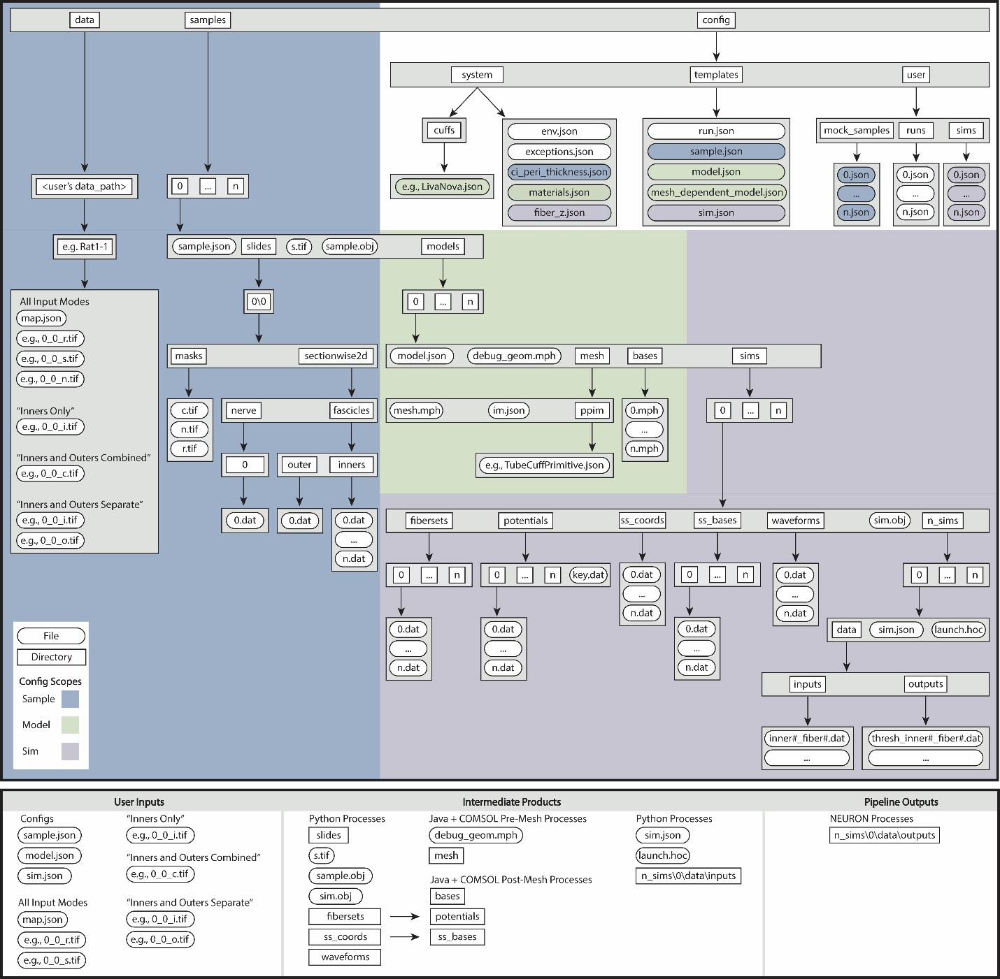

# Data Hierarchy
Each execution of the ASCENT pipeline requires a ***Run*** JavaScript
Object Notation (JSON) configuration file (`<run_index>.json`) that
contains indices for a user-defined set of JSON files. Specifically, a
JSON file is defined for each hierarchical domain of information: (1)
***Sample***: for processing segmented two-dimensional transverse
cross-sectional geometry of a nerve sample, (2) ***Model*** (COMSOL
parameters): for defining and solving three-dimensional FEM, including
geometry of nerve, cuff, and medium, spatial discretization (i.e.,
mesh), materials, boundary conditions, and physics, and (3) ***Sim***
(NEURON parameters): for defining fiber models, stimulation waveforms,
amplitudes, and durations, intracellular test pulses (for example, when
seeking to determine block thresholds), parameters for the binary search
protocol and termination criteria for thresholds, and flags to save
state variables. These configurations are organized hierarchically such
that ***Sample*** does not depend on ***Model*** or ***Sim***, and
***Model*** does not depend on ***Sim***; thus, changes in ***Sim*** do
not require changes in ***Model*** or ***Sample***, and changes in
***Model*** do not require changes in ***Sample*** (Figure A).

Figure A. ASCENT pipeline file structure in the context of Sample (blue), Model (green), and Sim (purple) configurations. [S7 Text](S7-JSON-configuration-files) describes the JSON configuration files an their contents, and [S8 Text](S8-JSON-file-parameter-guide) details the syntax and data types of the key-value parameter pairs.

##  Batching and sweeping of parameters

ASCENT enables the user to batch rapidly simulations to sweep cuff
electrode placement on the nerve, material properties, stimulation
parameters, and fiber types. The first process of ASCENT prepares
ready-to-submit NEURON simulations to model response of fibers to
extracellular stimulation. The second process of ASCENT uses Python to
batch NEURON jobs to a personal computer or compute cluster to simulate
fiber response to extracellular stimulation. Each task submitted to a
CPU simulates the response of a single fiber to either a set of finite
amplitudes or a binary search for threshold of activation or block,
therefore creating an "embarrassingly parallel" workload.

Groups of fibers from the same ***Sample***, ***Model***, ***Sim***,
waveform, contact weight (i.e., `"src_weights"` in ***Sim***), and
fiberset (i.e., a group of fibers with the same geometry and channels
and occupy different (x,y)-locations in the nerve cross section) are
organized in the same `n_sim/` directory.

A ***Run*** creates simulations for a single ***Sample*** and all pairs
of listed ***Model(s)*** and ***Sim(s)***. A user can pass a list of
***Run*** configurations in a single system call with `"python run
pipeline <run_indices>"` to simulate multiple ***Sample***
configurations in the same system call.

***Sample*** and ***Model*** cannot take lists of parameters. Rather, if
the user would like to assess the impact of ranges of parameters for
***Sample*** or ***Model***, they must create additional ***Sample***
and ***Model*** configuration files for each parameter value.

***Sim*** can contain lists of parameters in `"active_srcs"` (i.e., cuff
electrode contact weightings), `"fibers"`, `"waveform"`, and
`"supersampled_bases"`.
