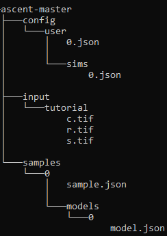
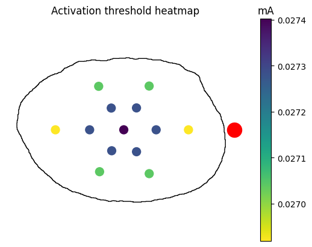

# Getting Started
Our video tutorial covers all the content in this page, plus explanations of how ASCENT works! See it below:
<iframe width="560" height="315" src="https://www.youtube.com/embed/C41nHvMXyEo" title="YouTube video player" frameborder="0" allow="accelerometer; autoplay; clipboard-write; encrypted-media; gyroscope; picture-in-picture; web-share" allowfullscreen></iframe>

## Installation

### Installing commercial software

In ASCENT, all programs/commands are run from a command line environment (Bash terminal for macOS/Linux, Powershell for Windows). It is _highly_ recommended that you install the package management system [Miniconda](https://docs.conda.io/en/latest/miniconda.html) or [Anaconda](https://www.anaconda.com/products/individual) (if using macOS, choose .pkg for ease of use). However, advanced users who wish to use another Python distribution may.

First, these software packages must be manually installed:

- [Miniconda](https://docs.conda.io/en/latest/miniconda.html)/[Anaconda](https://www.anaconda.com/products/individual) We recommend that you install Miniconda (Miniconda is a stripped down version of Anaconda; Anaconda is optional for intermediate users). If you already have an existing installation, there is no need to reinstall.
  - Recommended: Select add to path
  - Recommended: Select "Install for individual user"
- [Java SE Development Kit 8 (1.8)](https://www.oracle.com/java/technologies/javase/javase-jdk8-downloads.html) (need to register for a free account)
  - If your COMSOL version is 6.0 or newer, you may instead install [Java 11](https://www.oracle.com/java/technologies/downloads/#java11).
- [COMSOL Multiphysics 5.4 or newer](https://www.comsol.com/product-download) (requires purchase of license; only base package needed, which includes the COMSOL Java API)
  - Once COMSOL is installed, alter 'File System Access' permissions via File → Preferences → Security → Methods and Java Libraries → File System Access → All Files.
  - Note that COMSOL versions may slightly change (<1%) the outputs from ASCENT. Please avoid comparing results across COMSOL versions where possible.
- [NEURON 7.6.7 or newer](https://nrn.readthedocs.io/en/latest/install/install_instructions.html) (newer versions have been released, but compatibility has yet to be confirmed; choose appropriate installer depending on operating system; install auxiliary software as prompted by NEURON installer)
  - Depending on your operating system, some additional dependencies may be required. Make sure to follow the installation instructions carefully.
  - NEURON must be in your PATH in order to run simulations. Either choose the add to path option during installation, or on Linux, you can add to your bash profile: `export PATH=<path/to/neuron/>:$PATH`. The NEURON path should end with `bin`.
   ```{caution}
   ASCENT may have issues running on Apple Silicon and other ARM platforms. Building an older version of NEURON (version 7.x) for ARM from source is a potential fix for these problems. Refer to the NEURON docs for prerequisites and instructions.
   ```
Users may also download a text editor or integrated development environment (IDE) of their choosing to view/edit code (e.g., [Atom](https://atom.io/), [Visual Studio Code](https://code.visualstudio.com/), [IntelliJ IDEA](https://www.jetbrains.com/idea/download/)). For Java code, full autocomplete functionality requires adding both the path to the COMSOL installation ending in `plugins` as well as the path `<ASCENT_PATH>/bin/json-20190722.jar` to the list of available libraries (usually from within the IDE’s project settings). To run code in your IDE, newer version of COMSOL may also require you to check the box `File>Preferences>Security>Methods and Java Libraries>Allow access to network sockets`.

### Installing ASCENT

1. First, download or clone the SPARC ASCENT pipeline from [GitHub](https://github.com/wmglab-duke/ascent) to a desired location that will be referenced in step 3. Downloading is a much simpler process than cloning via Git, but does not easily allow for you to get the most recent updates/bug fixes, nor does it allow you to suggest new features/changes. If you are interested in either of these features, you should clone via Git rather than downloading.

   - Downloading: Click the [download](https://github.com/wmglab-duke/ascent/archive/refs/heads/master.zip) button on GitHub and choose the location to which you would like to save. Note that you will need to extract the files, as they will be downloaded in a compressed format. When presented with a choice of compression format, ".zip" is a safe choice that most computers will be able to extract.
   - Cloning via Git:
     1. You must first have an account with GitHub, and if you have been granted special permissions to the code repository, you must use the email address to which those permissions were granted.
     2. If you have not already done so, add an SSH key to your account (see instructions for [GitHub](https://docs.github.com/en/github/authenticating-to-github/connecting-to-github-with-ssh)). This is a required standard authentication method.
     3. In a Miniconda (or Git, for advanced users) command line environment, navigate to the location to where you would like to clone the code repository (see instructions for navigating the file system from the command line for [Mac or Linux](https://www.redhat.com/sysadmin/navigating-linux-filesystem) and [Windows](https://blogs.umass.edu/Techbytes/2014/11/14/file-navigation-with-windows-command-prompt/)).
     4. Clone the repository (see instructions for [GitHub](https://docs.github.com/en/repositories/creating-and-managing-repositories/cloning-a-repository)).
     5. For more information on using Git, check out the [official documentation](https://git-scm.com/doc).

2. Next, install ASCENT dependencies:
   - Windows: Open the Anaconda Powershell Prompt from the Windows Start Menu as Administrator, and use cd to navigate to the root directory of the pipeline. Then, run `python run install`.
        ```{caution}
        If reinstalling ASCENT after having changed your Anaconda/Miniconda installation, it may be necessary to delete the `#region conda initialize` block from `C:\Users\<username>\Documents\WindowsPowerShell\profile.ps1` in order to use Anaconda Powershell Prompt.
        ```
   - MacOS/Linux: Open Anaconda Prompt and use cd to navigate to the root directory of the pipeline. Then, run `python run install`.
   - For advanced users using their own (non-conda) Python distribution:
     - From the ascent root directory execute `python run install --no-conda`
     - From the ascent root directory execute `pip install -r requirements.txt`
     - This method is highly discouraged as newer versions of packages/Python could potentially break ASCENT or introduce unexpected bugs

After confirming that you are in the correct directory, the script will install the required Python packages.

1. Then, configure the environment variables. This step may be completed several ways, described below.
   - Recommended Setup: Open Anaconda prompt, navigate to the ASCENT root directory, and execute `python run env_setup`. You will be prompted for the following paths:
     - ASCENT_COMSOL_PATH: Path to the COMSOL installation, ending in the directory name "Multiphysics", as seen in the template and [JSON Overview](JSON/JSON_overview).
     - ASCENT_JDK_PATH: Path to the JDK 1.8 installation, ending in `bin`, as seen in the template and [JSON Overview](JSON/JSON_overview). Hint: This is the correct path if the directory contains many executables (for Windows: java.exe, etc.; MacOS/Linux: java, etc.).
     - ASCENT_PROJECT_PATH: Path to the root directory of the pipeline, as chosen for step 1.
     - ASCENT_NSIM_EXPORT_PATH: Path to the export location for NEURON "simulation" directories. This path only depends on the user's desired file system organization.
   - Manual Setup: Copy the file `config/templates/env.json` into `config/system/env.json` (new file). This file holds important paths for software used by the pipeline (see env.json in [Enums](Code_Hierarchy/Python.md#enums) and [JSON Overview](JSON/JSON_overview)). Then, edit each of the four values as specified below. Use `\\` in Windows and `/` in macOS/Linux operating systems. Note that the file separators are operating system dependent, so even if you installed in step 2 with Unix-like command environment on a Windows machine (e.g., using [Git Bash](https://gitforwindows.org/), [Cygwin](https://www.cygwin.com/), or a VM with [Ubuntu](https://ubuntu.com/)), you will still need to choose the proper file separator for Windows, i.e., `\\`). See example env.json files for both macOS and Windows ([Environment Parameters](JSON/JSON_parameters/env)).
   - Automatic setup: Upon the initiation of your first run, you will be prompted to enter the above four paths if you did not choose to complete the manual setup. Enter them as prompted, following the guidelines detailed above and exemplified in [JSON Overview](JSON/JSON_overview). Note that you may at any time update paths with `python run env_setup` to rewrite this file if the information should change.

## Metadata required to model an in vivo experiment using the ASCENT pipeline

```{note} All metadata required for the [tutorial run](#setting-up-a-run-of-ascent) are provided with ASCENT.
```

1. Detailed specifications / dimensions of the stimulating cuff
   electrode.

2. Transverse cross-section of the nerve where the cuff is placed,
   stained to visualize the different tissue types (e.g., using
   Masson’s trichrome), with a scale bar ([Fig 2](https://doi.org/10.1371/journal.pcbi.1009285.g002) and [Morphology Inputs](Running_ASCENT/Info.md#morphology-input-files))) or known scale (micrometers/pixel). Different possible sources
   for defining the nerve sample morphology include:

   a. For best specificity, the nerve would be sampled from the
   specific animal used in the experiment being modeled. In this
   case, two colors of tissue dye may be used on the ventral and
   medial aspects of the nerve to maintain orientation information.

   b. Otherwise, a sample from another animal of the same species
   could be used at the correct nerve level.

   c. If multiple samples from other animals are available, they could
   be used to generate a representative nerve model, knowing the
   range of morphological metrics across individuals using the
   `scripts/mock_morphology_generator.py` script ([Mock Morphology](MockSample)).

   d. Lastly, published data could be used.

3. Orientation and rotation of the cuff on the nerve (e.g., cuff
   closure on the ventral side of the nerve).

4. Fiber diameters

   a. Distributions of fiber diameters may be obtained from
   literature; otherwise, detailed electromicroscopic studies are
   required.

   b. The fiber diameters found in the target nerve that will be
   simulated in NEURON. All diameters or a subset of diameters may
   be of interest.

   c. Each fiber diameter of interest can be simulated for each fiber
   location of interest, or specific fiber diameters can be
   simulated in specific locations.

5. Approximate tissue or fluids surrounding the nerve and cuff (e.g.,
   muscle, fat, or saline).

6. Stimulation waveforms, pulse widths, and other parameters of the
   electrical signal.

7. If comparing to neural recordings: distance between the stimulation
   and recording cuffs.

8. If comparing to functional recordings (e.g., EMG): distance from the
   stimulation cuff to the location where the nerve inserts into the
   muscle.

## Setting up a run of ASCENT

`````{tab} Tutorial Run

_How to run the ASCENT tutorial, after completing the initial setup._

**Overview**

Follow the instructions below and verify the threshold value to familiarize yourself with the ASCENT code and documentation.

We provide segmented histology of a rat cervical vagus nerve.
Use the provided histology and configurations files to simulate activation thresholds in
response to a charge balanced, biphasic pulse (PW1 = 100 μs, interphase
gap of 100 μs, PW2 = 400 μs) using Purdue’s bipolar cuff design.

- MRG 8.7 μm diameter fibers

- Fibers placed in nerve cross-section using a 6 spoke wheel with 2
  fibers per spoke

- Custom material for surrounding medium with isotropic conductivity
  1/20 \[S/m\]

After your thresholds have been computed, build a heatmap for the
thresholds at each fiber location.

Through this exercise, you will:

- Set up nerve morphology masks

- Define model with a custom material

- Build and solve a finite element model

- Define placement of fibers in the nerve cross-section

- Simulate activation thresholds for a specific fiber model using a custom waveform

- Generate a heatmap of fiber activation thresholds

**Step-by-step instructions**

````{note}
For this tutorial, use the files provided in the `examples/tutorial/` directory.
The below example directory structure may be helpful.
```{details} Example directory structure

```
````

1. **_Input Masks:_** Create the directory `input/tutorial/`.
   Place the masks (.tif images) from `examples/tutorial/` here

    ```{important}
    In steps 2-5, you can choose any number for `sample_index`, `model_index`, `sim_index`, and `run_index`.
    However, the instructions here assume you chose 0 for all of these indices.
    ```

2. **_Sample:_** Create the directory `samples/<sample_index>/`.
   Copy `sample.json` from `examples/tutorial/`
   to the folder you just created (e.g. `samples/0/`).

3. **_Model:_** Create the directory `samples/<sample_index>/models/<model_index>/`.
   Copy `model.json` from `examples/tutorial/`
   to the folder you just created (e.g. `samples/0/models/0/`).

4. **_Sim:_** Copy `sim.json` from `examples/tutorial/` to
   `config/user/sims/` and rename the file to `<sim_index>.json`.

5. **_Run:_** Copy `run.json` from `config/templates/` to
   `config/user/runs/` and rename the file to `<run_index>.json`.
   Open the file and edit your sample, model, and sim indices to match the ones you chose above.

6. Run the pipeline with the command`python run pipeline <run_index>` (e.g. `python run pipeline 0`).
   The pipeline will generate ready-to-run NEURON simulations
   and export them to the `"ASCENT_NSIM_EXPORT_PATH"` defined during installation.

7. Run the NEURON simulations by navigating to the your `"ASCENT_NSIM_EXPORT_PATH"` and running the command `python submit.py <run_index>`. This may take some time.

8. After the NEURON simulations have completed, move the outputs back to the ASCENT directory structure by running the command `python run import_n_sims <run_index>`.

    ```{admonition} Check
    Threshold for inner0_fiber0 (`samples/<sample_index>/models/<model_index>/sims/<sim_index>/n_sims/data/outputs/thresh_inner0_fiber0.dat`) should be -0.027402 mA (or -0.027281 mA if COMSOL 6.1 is installed).
    ```

9. To generate a heatmap of activation thresholds, open the script `examples/analysis/threshold_heatmap.py` and edit the sample, model, and sim indices to match the ones you chose above. Run the script from the repository root with the command `python examples/analysis/threshold_heatmap.py`, and a heatmap plot will be generated in `output/analysis/`. Your heatmap should look like the one below.

`````

````{tab} General Procedure

_How to run the ASCENT pipeline, after completing the initial setup._

```{figure} uploads/pipeline_requirements.png
Overview of the requirements to run the ASCENT pipeline.
```

To set up a run of the pipeline, you must provide binary mask inputs for the nerve and save **_Sample_**
(i.e., `sample.json`), **_Model(s)_** (i.e., `model.json`), and **_Sim(s)_**
(i.e., `sim.json`) JSON configurations in directories, relative to the
project path defined in `config/system/env.json`. The directory names must
use indices that are consistent with the indices of **_Sample_**,
**_Model(s)_**, and **_Sim(s)_** defined in **_Run_**.

1. **_Masks:_** Populate `input/<NAME>/` (e.g., "Rat1-1", which
   must match "sample" parameter in **_Sample_**) with binary masks of
   neural tissue boundaries using either:

   a. [Segmented histology](Running_ASCENT/Info.md#morphology-input-files) and [Fig 2](https://doi.org/10.1371/journal.pcbi.1009285.g002)), or

   b. The `mock_morphology_generator.py` script ([Mock Morphology](MockSample)).

   1. Copy `mock_sample.json` from `config/templates/` to
      `config/user/mock_samples/` as `<mock_sample_index>.json`
      and update file contents, including the "NAME" parameter
      used to construct the destination path for the output binary
      masks, which serve as inputs to the pipeline.

   2. Call `"python run mock_morphology_generator <mock_sample_index>"`.

   3. The program saves a copy of your `mock_sample.json` and
      binary masks in `input/<NAME>/`.

2. **_For one Sample:_** Copy `sample.json` from `config/templates/`
   to `samples/<sample_index>/` as `sample.json` and edit its contents
   to define the processing of binary masks to generate the
   two-dimensional cross-section geometry of the nerve in the FEM. In
   particular, change "sample" to match `<NAME>`, the
   `"scale_bar_length"` parameter for `s.tif` (i.e., length in microns
   of your scale bar, which is oriented horizontally), and
   `"mask_input"` in **_Sample_** accordingly ([Sample Parameters](JSON/JSON_parameters/sample)). You have now created
   the directory for your first sample: `sample #<sample_index>`. Note: in lieu of a scale bar image, the user may optionally specify the microns/pixel ratio for the sample mask(s).

3. **_For each Model:_** Copy `model.json` from `config/templates/`
   to `samples/<sample_index>/models/<model_index>/` as `model.json`
   and edits its contents to define the three-dimensional FEM.

   a. Assign the cuff geometry to be used by placing a file name from `config/system/cuffs` in `"cuff":"preset"`.

   b. Optionally, define a new cuff geometry specific to your needs:

   1. **_Preset:_** User defines a new "preset" cuff JSON file, which
      contains instructions for creating their cuff electrode, and
      saves it as `config/system/cuffs/<preset_str>.json`.

   2. The `<preset_str>.json` file name must be assigned to the
      "preset" parameter in **_Model_** ([Model Parameters](JSON/JSON_parameters/model)).

4. **_For each Sim:_** Copy `sim.json` from `config/templates/` to
   `config/user/sims/` as `<sim_index>.json` and edit its contents to
   inform the NEURON simulations ([Sim Parameters](JSON/JSON_parameters/sim)).

5. **_Run:_** Copy `run.json` from `config/templates/` to
   `config/user/runs/` as `<run_index>.json` and edit the indices for
   the created **_Sample_**, **_Model(s)_**, and **_Sim(s)_**
   configurations ([Run Parameters](JSON/JSON_parameters/run)).

6. The pipeline is run from the project path (i.e., the path to the
   root of the ASCENT pipeline, which is defined in
   `config/system/env.json`) with the command `"python run pipeline <run indices>"`, where `<run indices>` is a list of space-separated
   **_Run_** indices (if multiple **_Sample_** indices, one **_Run_**
   for each). The pipeline outputs ready-to-submit NEURON simulations
   and associated **_Run file(s)_** to the `"ASCENT_NSIM_EXPORT_PATH"`
   directory as defined in `config/system/env.json` ([Environment Parameters](JSON/JSON_parameters/env)). NEURON simulations
   are run locally or submitted to a computer cluster with the command
   `"python submit.py <run indices>"` from the export directory.
````

```{seealso}
For more information on ASCENT read about [ASCENT usage](Running_ASCENT/Usage.md),
[ASCENT inputs and controls](Running_ASCENT/Info.md),
and [ASCENT parameter options](JSON/JSON_parameters/index.rst).
```
