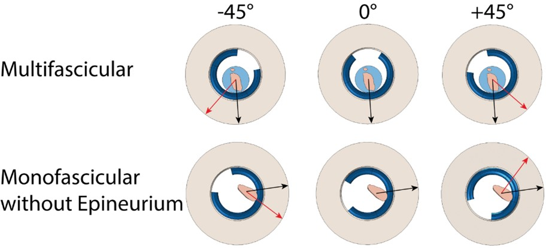
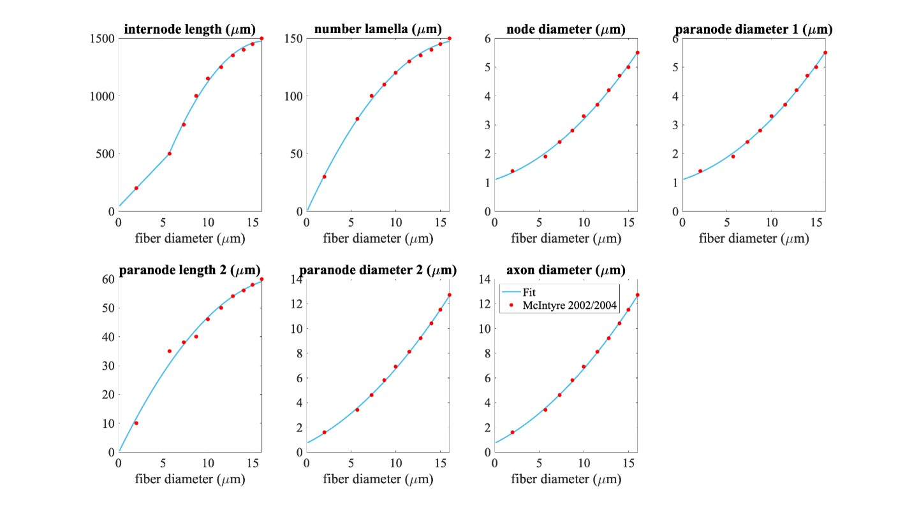
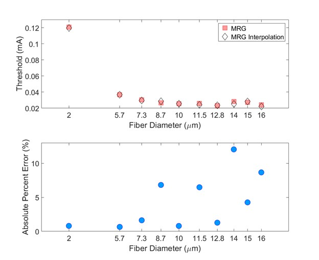

# Information on ASCENT controls
## Morphology Input Files
Each mask must be binary (i.e., white pixels (‘1’) for the segmented
tissue and black pixels (‘0’) elsewhere) and must use Tagged Image File
Format (i.e., `.tif`, or `.tiff`). All masks must be defined within the same
field of view, be the same size, and be the same resolution. To convert
between pixels of the input masks to dimensioned length (micrometers), the user must specify
a `"ScaleInputMode"` in ***Sample*** ([JSON Configuration Files](../JSON/index)). If using the mask input mode, a mask for the scale bar (`s.tif`) of known length (oriented horizontally) must be provided (see "Scale Bar" in [Fig 2](https://doi.org/10.1371/journal.pcbi.1009285.g002)) and the length of the scale
bar must be indicated in ***Sample*** ([JSON Configuration Files](../JSON/index)). If using the ratio input mode, the user explicitly specifies the micrometers/pixel of the input masks in ***Sample*** ([JSON Configuration Files](../JSON/index)), and no scale bar image is required.

The user is required to set the `"MaskInputMode"` in ***Sample***
(`"mask_input"`) to communicate the contents of the segmented histology
files ([JSON Configuration Files](../JSON/index)). Ideally, segmented images of boundaries for both the "outers"
(`o.tif`) and "inners" (`i.tif`) of the perineurium will be provided, either
as two separate files (`o.tif` and `i.tif`) or combined in the same image
(`c.tif`) (see "Inners", "Outers", and "Combined" in [Fig 2](https://doi.org/10.1371/journal.pcbi.1009285.g002)). However, if
only inners are provided—which identify the outer edge of the
endoneurium—a surrounding perineurium thickness is defined by the
`"PerineuriumThicknessMode"` in ***Sample***
(`"ci_perineurium_thickness"`); the thickness is user-defined,
relating perineurium thickness to features of the inners (e.g., their
diameter). It should be noted that defining nerve morphology with only
inners does not allow the model to represent accurately fascicles
containing multiple endoneurium inners within a single outer perineurium
boundary ("peanut" fascicles; see an example in [Fig 2](https://doi.org/10.1371/journal.pcbi.1009285.g002)); in this case,
each inner trace will be assumed to represent a single independent
fascicle that does not share its perineurium with any other inners; more
accurate representation requires segmentation of the "outers" as well.

The user is required to set the `"NerveMode"` in ***Sample*** ("nerve") to
communicate the contents of the segmented histology files ([JSON Configuration Files](../JSON/index)). The outer
nerve boundary, if present, is defined with a separate mask (`n.tif`). In
the case of a compound nerve with epineurium, the pipeline expects the
outer boundary of the epineurium to be provided as the "nerve". In the
case of a nerve with a single fascicle, no nerve mask is required—in
which case either the outer perineurium boundary (if present) or the
inner perineurium boundary (otherwise) is used as the nerve
boundary—although one may be provided if epineurium or other tissue
that would be within the cuff is present in the sample histology.

Lastly, an "orientation" mask (`a.tif`) can be optionally defined. This
mask should be all black except for a small portion that is white,
representing the position to which the cuff must be rotated. The angle
is measured *relative to the centroid of the nerve/singular fascicle*,
so this image should be constructed while referencing `n.tif` (or, if
monofascicular, `i.tif`, `o.tif`, or `c.tif`). By default, the 0º position of
our cuffs correspond with the coordinate halfway along the arc length of
the cuff inner diameter (i.e., the cuff will be rotated such that the sample center, cuff
contact center, and centroid of the white portion of `a.tif` form a line) while the
circular portion of a cuff’s diameter is centered at the origin (Note: this rotation process uses `"angle_to_contacts_deg"` and `"fixed_point"` in a "preset"
cuff’s JSON file, see [Creating Custom Cuffs](../Primitives_and_Cuffs/Custom_Cuffs) and [Cuff Placement on the Nerve](../Running_ASCENT/Info.md#cuff-placement-on-nerve)). If `a.tif` is provided, other cuff rotation methods
(`"cuff_shift"` in ***Model***, which calculate `"pos_ang"`) are
overridden.

The user must provide segmented image morphology files, either from
histology or the `mock_morphology_generator.py` script, with a specific
naming convention in the `input/` directory.

  - Raw RGB image, to be available for convenience and used for data
    visualization: `r.tif` (optional).

  - Combined (i.e., inners and outers): `c.tif`.

  - Inners: `i.tif`

      - An "inner" is the internal boundary of the perineurium that
        forms the boundary between the perineurium and the endoneurium.

  - Outers: `o.tif`

      - An "outer" is the external boundary of the perineurium that
        forms the boundary between the perineurium and the epineurium or
        extraneural medium.

  - Scale bar: `s.tif` (scale bar oriented horizontally, required unless scale input mode is set to ratio).

  - Nerve: `n.tif` (optional for monofascicular nerves).

  - Orientation: `a.tif` (optional).

For an example of input files, see [Fig 2](https://doi.org/10.1371/journal.pcbi.1009285.g002). The user must properly set
the `"MaskInputMode"` in ***Sample*** (`"mask_input"`) for their provided
segmented image morphology files ([JSON Configuration Files](../JSON/index)).

## Control of medium surrounding nerve and cuff electrode
The medium surrounding the nerve and cuff electrode (e.g., fat, skeletal
muscle) must contain a "proximal" domain, which runs the full length of
the nerve, and may optionally include a "distal" domain. The
parameterization for the geometry of the "proximal" and "distal" domains
is shown below in Figure A. For details on how to define the
"proximal" and "distal" domain geometries and meshing parameters, see
[Model Parameters](../JSON/JSON_parameters/model).


Figure A. The user must define a "proximal" domain, and may optionally define a "distal" domain for independent assignment of meshing parameters for the site of stimulation from the rest of the FEM. The "proximal" domain runs the full length of the nerve and is anchored at (0,0,0). The distal domain’s radius and length may be independently assigned, and the entire distal domain may be shifted ("shift": (x, y, z)). Having a proximal domain that is overly voluminous can significantly decrease COMSOL meshing efficiency and even, rarely, cause errors. At all costs, avoid having a proximal or distal domain whose boundary intersects with a geometry (other than the nerve ends, which are by definition at the longitudinal boundaries of the proximal domain) or the boundary of other geometries (e.g., the cuff-nerve boundary); this will likely create a meshing error.

## Cuff placement on nerve
This section provides an overview of how the cuff is placed on the
nerve. The `compute_cuff_shift()` method within Runner (`src/runner.py`)
determines the cuff’s rotation around the nerve and translation in the
(x,y)-plane. The pipeline imports the coordinates of the traces for the
nerve tissue boundaries saved in
`samples/<sample_index>/slides/0/0/sectionwise2d/` which are, by
convention, shifted such that the centroid of the nerve is at the origin
(0,0) (i.e., nerve centroid from best-fit ellipse if nerve trace (`n.tif`)
is provided, inner or outer best-fit ellipse centroid for monofascicular
nerves without nerve trace). Importantly, the nerve sample cross section
is never moved from or rotated around the origin in COMSOL. By
maintaining consistent nerve location across all ***Model’s*** for a
***Sample,*** the coordinates in `fibersets/` are correct for any
orientation of a cuff on the nerve.

ASCENT has different `CuffShiftModes` (i.e., `"cuff_shift"` parameter in
***Model***) that control the translation of the cuff (i.e., "shift"
JSON Object in ***Model***) and default rotation around the nerve (i.e.,
`"pos_ang"` in ***Model***). Runner’s `compute_cuff_shift()` method is
easily expandable for users to add their own `CuffShiftModes` to control
cuff placement on the nerve.

The rotation and translation of the cuff are populated
automatically by the `compute_cuff_shift()` method based on sample morphology, parameterization of the "preset" cuff, and the `CuffShiftMode`, and are defined in the "cuff" JSON
Object ("shift" and "rotate") in ***Model***.

For "naïve" `CuffShiftModes` (i.e.,
`"NAIVE_ROTATION_MIN_CIRCLE_BOUNDARY",
"NAIVE_ROTATION_TRACE_BOUNDARY"`) the cuff is placed on the nerve
with rotation according to the parameters used to instantiate the cuff
from part primitives ([Part Primitives and Custom Cuffs](../Primitives_and_Cuffs/index)). If the user would like to rotate the cuff from
beyond this position, they may set the `"add_ang"` parameter in
***Model*** ([Model Parameters](../JSON/JSON_parameters/model)). For naïve `CuffShiftModes`, the cuff is shifted along the
vector from (0,0) in the direction of the `"angle_to_contacts_deg"`
parameter in the "preset" JSON file.
`"NAIVE_ROTATION_MIN_CIRCLE_BOUNDARY"` `CuffShiftMode` moves the cuff
toward the nerve until the nerve’s minimum radius enclosing circle is
within the distance of the `"thk_medium_gap_internal"` parameter for
the cuff. `"NAIVE_ROTATION_TRACE_BOUNDARY"` `CuffShiftMode` moves the
cuff toward the nerve until the nerve’s outermost Trace (i.e., for
monofascicular nerve an inner or outer, and same result as
`"NAIVE_ROTATION_MIN_CIRCLE_BOUNDARY"` for nerve’s with epineurium)
is within the distance of the `"thk_medium_gap_internal"` parameter for
the cuff. Note: orientation masks (`a.tif`) are ignored when using these modes.

For "automatic" `CuffShiftModes` (i.e.,
`"AUTO_ROTATION_MIN_CIRCLE_BOUNDARY",
"AUTO_ROTATION_TRACE_BOUNDARY"`) the cuff is rotated around the
nerve based on the size and position of the nerve’s fascicle(s) before
the cuff is moved toward the nerve sample (Figure A). The point at
the intersection of the vector from (0,0) in the direction of the
`"angle_to_contacts_deg"` parameter in the "preset" JSON file with
the cuff (i.e., cuff’s "center" in following text) is rotated to meet a specific location of the nerve/monofascicle’s
surface. Specifically, the center of the cuff is rotated around the
nerve to make (0,0), the center of the cuff, and ***Sample’s***
`"fascicle_centroid"` (computed with Slide’s `fascicle_centroid()`
method, which calculates the area and centroid of each inner and then
averages the inners’ centroids weighted by each inner’s area) colinear.
If the user would like to rotate the cuff from beyond this position, they may set the
`"add_ang"` parameter in ***Model*** ([Model Parameters](../JSON/JSON_parameters/model)). The user may override the
default "AUTO" rotation of the cuff on the nerve by adding an
orientation mask (`a.tif`) to align a certain surface of the nerve sample
with the cuff’s center (../Running_ASCENT/Info.md#morphology-Input-Files)). This behavior depends on the
cuff's `"fixed_point"` parameter ([Creating Custom Cuffs](../Primitives_and_Cuffs/Custom_Cuffs)) The `"AUTO_ROTATION_MIN_CIRCLE_BOUNDARY"`
`CuffShiftMode` moves the cuff toward the nerve until the nerve’s minimum
radius enclosing circle is within the distance of the
`"thk_medium_gap_internal"` parameter for the cuff.
`"AUTO_ROTATION_TRACE_BOUNDARY"` `CuffShiftMode` moves the cuff toward
the nerve until the nerve’s outermost Trace (i.e., for monofascicular
nerve an inner or outer, and same result as
`"AUTO_ROTATION_MIN_CIRCLE_BOUNDARY"` for nerve’s with epineurium)
is within the distance of the `"thk_medium_gap_internal"` parameter for
the cuff.



Figure A. Demonstration of cuff placement on a multifascicular nerve (top) and a monofascicular nerve without epineurium (bottom) with the same "preset" cuff (Purdue.json) for three different cuff rotations using the "AUTO_ROTATION_TRACE_BOUNDARY" CuffShiftMode. The cuff rotations are different in the top and bottom rows since the point on the surface of the nerve sample closest to the most endoneurium is unique to each sample (black arrows). Additional angles of rotation were applied to the cuff directly using the "add_ang" parameter in the ***Model’s*** "cuff" JSON Object (red arrows).

The default z-position of each part along the nerve is defined in the
"preset" cuff JSON file by the expression assigned to the part
instance’s "Center" parameter (referenced to z = 0 at one end of the
model’s proximal cylindrical domain). However, if the user would like to
move the entire "preset" cuff along the length of the nerve, in the
"cuff" JSON Object within ***Model***, the user may change the "z"
parameter.

Since some cuffs can open in response to a nerve diameter larger
than the manufactured cuff’s inner diameter, they maybe be parameterized
as a function of `"R_in"`. In this case, in the "preset" cuff JSON, the
"expandable" Boolean parameter is true. If the cuff is "expandable"
and the minimum enclosing diameter of the sample is larger than the
cuff, the program will modify the angle for the center of the cuff to
preserve the length of materials. If the cuff is not expandable and the
sum of the minimum enclosing circle radius of the sample and
`"thk_medium_gap_internal"` are larger than the inner radius of the
cuff, an error is thrown as the cuff cannot accommodate the sample
morphology.

The inner radius of the cuff is defined within the list of "params" in
each "preset" cuff configuration file as `"R_in"`, and a JSON Object
called "offset" contains a parameterized definition of any additional
buffer required within the inner radius of the cuff (e.g., exposed wire
contacts as in the `Purdue.json` cuff "preset"). Each key in the "offset"
JSON Object must match a parameter value defined in the "params" list of
the cuff configuration file. For each key in "offset", the value is the
multiplicative coefficient for the parameter key to include in a sum of
all key-value products. For example, in `Purdue.json`:

```
"offset": {
  "sep_wire_P": 1, // separation between outer boundary of wire contact and internal
                 // surface of insulator
  "r_wire_P": 2 // radius of the wire contact’s gauge
}
```

This JSON Object in `Purdue.json` will instruct the system to maintain
added separation between the internal surface of the cuff and the nerve
of:


The div element has its own alignment attribute, align.

<div align="center">
(1) * <i>sep_wire_P</i> + (2) * <i>r_wire_P</i>
</div>

## Simulation Protocols

Fiber response to electrical stimulation is computed by applying
electric potentials along the length of a fiber from COMSOL as a
time-varying signal in NEURON. The stimulation waveform, saved in a
`n_sim’s data/inputs/` directory as `waveform.dat`, is unscaled (i.e., the
maximum current magnitude at any timestep is +/-1), and is then scaled
by the current amplitude in `RunSim.hoc` to either simulate fiber thresholds of
activation or block with a binary search algorithm, or response to set
amplitudes.

###  Binary search

In searching for activation thresholds (i.e., the minimum stimulation
amplitude required to generate a propagating action potential) or block
thresholds (i.e., the minimum stimulation amplitude required to block
the propagation of an action potential) in the pipeline, the NEURON code
uses a binary search algorithm.

The basics of a binary search algorithm are as follows. By starting with
one value that is above threshold (i.e., upper bound) and one value that
is below threshold (i.e., lower bound), the program tests the midpoint
amplitude to determine if it is above or below threshold. If the
midpoint amplitude is found to be below threshold, the midpoint
amplitude becomes the new lower bound. However, if the midpoint
amplitude is found to be above threshold, the midpoint amplitude becomes
the new upper bound. At each iteration of this process, half of the
remaining amplitude range is removed. The process is continued until the
termination criteria is satisfied (e.g., some threshold resolution
tolerance is achieved). The average performance of a binary search
algorithm is Ο(log(*n*)) where n is the number of
elements in the search array (i.e., linearly spaced range of
amplitudes).

In the pipeline, the binary search protocol parameters (i.e., activation
or block criteria, threshold criteria, method for searching for starting
upper- and lower bounds, or termination criteria) are contained in the
"protocol" JSON Object within ***Sim*** ([Sim Parameters](../JSON/JSON_parameters/sim)).

###  Activation threshold protocol

The pipeline has a NEURON simulation protocol for determining thresholds
of activation of nerve fibers in response to extracellular stimulation.
Threshold amplitude for fiber activation is defined as the minimum
stimulation amplitude required to initiate a propagating action
potential. The pipeline uses a binary search algorithm to converge on
the threshold amplitude. Current amplitudes are determined to be above
threshold if the stimulation results in at least `n_AP` propagating
action potentials detected at 75% of the fiber’s length (note: location
can be specified by user with `"ap_detect_location"` parameter in
***Sim***) ([Sim Parameters](../JSON/JSON_parameters/sim)). The parameters for control over the activation threshold
protocol are found in ***Sim*** within the "protocol" JSON Object ([Sim Parameters](../JSON/JSON_parameters/sim)).

###  Block threshold protocol

The pipeline has a NEURON simulation protocol for determining block
thresholds for nerve fibers in response to extracellular stimulation.
Threshold amplitude for fiber block is defined as the minimum
stimulation amplitude required to block a propagating action potential.
The simulation protocol for determining block thresholds starts by
delivering the blocking waveform through the cuff. After a user-defined
delay during the stimulation onset period, the protocol delivers a test
pulse (or a train of pulses if the user chooses) where the user placed
it (see "ind" parameter in ***Sim*** within the `"intracellular_stim"`
JSON Object ([Sim Parameters](../JSON/JSON_parameters/sim))), near the proximal end. The code checks for action
potentials near the distal end of the fiber (see `"ap_detect_location"`
parameter in ***Sim*** within the "threshold" JSON Object ([Sim Parameters](../JSON/JSON_parameters/sim))). If at least
one action potential is detected, then transmission of the test pulse
occurred (i.e., the stimulation amplitude is below block threshold).
However, the absence of an action potential indicates block (i.e., the
stimulation amplitude is above block threshold). The pipeline uses a
binary search algorithm to converge on the threshold amplitude. The
parameters for control over the block threshold protocol are found in
***Sim*** within the "protocol" JSON Object ([Sim Parameters](../JSON/JSON_parameters/sim)).

The user must be careful in setting the initial upper and lower bounds
of the binary search for block thresholds. Especially for small diameter
myelinated fibers, users must be aware of and check for re-excitation
using a stimulation amplitude sweep {cite:p}`Pelot2017`.

###  Response to set amplitudes

Alternatively, users may simulate the response of nerve fibers in
response to extracellular stimulation for a user-specified set of
amplitudes. The "protocol" JSON Object within ***Sim*** contains the set
of amplitudes that the user would like to simulate ([Sim Parameters](../JSON/JSON_parameters/sim)).

## Implementation of NEURON fiber models

### Myelinated fiber models

The `CreateAxon_Myel.hoc` file is loaded in `Wrapper.hoc` if the user
chooses either `"MRG_DISCRETE"` or `"MRG_INTERPOLATION"`. The length of
each section in NEURON varies depending on both the diameter and the
"FiberGeometry" mode chosen in ***Sim***.

#### MRG discrete diameter (as previously published)

The "FiberGeometry" mode `"MRG_DISCRETE"` in ***Sim*** instructs the
program to simulate a double cable structure for mammalian myelinated
fibers {cite:p}`McIntyre2004,McIntyre2002`. In the pipeline, we refer to this model as
`"MRG_DISCRETE"` since the model’s geometric parameters were originally
published for a *discrete* list of fiber diameters: 1, 2, 5.7, 7.3, 8.7,
10, 11.5, 12.8, 14.0, 15.0, and 16.0 μm. Since the MRG fiber model has
distinct geometric dimensions for each fiber diameter, the parameters
are stored in `config/system/fiber_z.json` as lists in the
`"MRG_DISCRETE"` JSON Object, where a value’s index corresponds to
the index of the discrete diameter in "diameters". The parameters are
used by the Fiberset class to create `fibersets/` (i.e., coordinates to
probe `potentials/` from COMSOL) for MRG fibers.

#### MRG interpolated diameters

The `"FiberGeometry"` mode `"MRG_INTERPOLATION"` in ***Sim*** instructs the
program to simulate a double cable structure for mammalian myelinated
fibers for any diameter fiber between 2 and 16 µm (throws an error if
not in this range) by using an *interpolation* over the originally
published fiber geometries {cite:p}`McIntyre2004,McIntyre2002`. In the pipeline, we refer to
this model as `"MRG_INTERPOLATION"` since it enables the user to simulate
any fiber diameter between the originally published diameters.

The parameters in the `"MRG_INTERPOLATION"` JSON Object in
`config/system/fiber_z.json` are used by the Fiberset class to create
`fibersets/` (i.e., coordinates at which to sample `potentials/` from
COMSOL) for interpolated MRG fibers. Since the parameter values relate
to fiber "diameter" as a continuous variable, the expressions for all
the dimensions that change with fiber diameter, as shown in Figure A, are stored as a String
that is computed using Python’s built-in `"eval()"` function.



Figure A. Piecewise polynomial fits to published MRG fiber parameters. Single quadratic fits were used for all parameters except for internode length, which has a linear fit below 5.643 µm (using MRG data at 2 and 5.7 µm) and a single quadratic fit at diameters greater than or equal to 5.643 µm (using MRG data >= 5.7 µm); 5.643 µm is the fiber diameter at which the linear and quadratic fits intersected. The fiber diameter is the diameter of the myelin. "Paranode 1" is the MYSA section, "paranode 2" is the FLUT section, and "internode" is the STIN section. The axon diameter is the same for the node of Ranvier and MYSA ("node diameter"), as well as for the FLUT and STIN ("axon diameter"). The node and MYSA lengths are fixed at 1 and 3 μm, respectively, for all fiber diameters.

We compared fiber activation thresholds between the originally published
MRG fiber models and the interpolated MRG ultrastructure (evaluated at
the original diameters) at a single location in a rat cervical vagus
nerve stimulated with the bipolar Purdue cuff. Each fiber was placed at
the centroid of the best-fit ellipse of the monofascicular nerve sample.
The waveform was a single biphasic pulse using
`"BIPHASIC_PULSE_TRAIN_Q_BALANCED_UNEVEN_PW"` with 100 µs for the
first phase, 100 µs interphase (0 mA), and 400 µs for the second phase
(cathodic/anodic at one contact and anodic/cathodic at the other
contact). The thresholds between the originally published models and the
interpolation of the MRG fiber diameters are compared in Figure B below.
The threshold values were determined using a binary search until the
upper and lower bound stimulation amplitudes were within 1%.



Figure B. Comparison of thresholds between the originally published models and the interpolation of the MRG fiber diameters (evaluated at the original diameters). Thresholds are expected to vary between the originally published models and the interpolated fiber geometries given their slightly different ultrastructure parameters (Figure A). Used original MRG thresholds as reference.

### Unmyelinated Fiber Models

The pipeline includes several unmyelinated (i.e., C-fiber) models
{cite:p}`Sundt2015,Tigerholm2014,Rattay1993`. Users should be aware of the `"delta_zs"` parameter that
they are using in `config/system/fiber_z.json`, which controls the
spatial discretization of the fiber (i.e., the length of each section).

## Defining and assigning materials in COMSOL

Materials are defined in the COMSOL "Materials" node for each material
"function" indicated in the "preset" cuff configuration file (i.e.,
cuff "insulator", contact "conductor", contact "recess", and cuff
"fill") and nerve domain (i.e., endoneurium, perineurium,
epineurium). Material properties for each function are assigned in
***Model*’s** "conductivities" JSON Object by either referencing
materials in the default materials library
(`config/system/materials.json`) by name, or with explicit definitions
of a materials name and conductivity as a JSON Object ([Material Parameters](../JSON/JSON_parameters/materials)).
See [link](link to ModelWrapper.addMaterialDefinitions()) for code one how this happens.

### Adding and assigning default material properties

Default material properties defined in `config/system/materials.json`
are listed in Table A. To accommodate automation of
frequency-dependent material properties (for a single frequency, i.e.,
sinusoid), parameters for material conductivity that are dependent on
the stimulation frequency are calculated in Runner’s
`compute_electrical_parameters()` method and saved to ***Model*** before
the handoff() method is called. Our pipeline supports calculation of the
frequency-dependent conductivity of the perineurium based on
measurements from the frog sciatic nerve {cite:p}`Weerasuriya1984` using the
`rho_weerasuriya()` method in the Python Waveform class. See [Fig. 2](https://doi.org/10.1371/journal.pcbi.1009285.g002) for
identification of tissue types in a compound nerve cross section (i.e.,
epineurium, perineurium, endoneurium).

Table A. Default material conductivities.

| **Material**  | **Conductivity**             | **References**         |
| ------------- | ---------------------------- | ---------------------- |
| silicone      | 10^-12 \[S/m\]               | {cite:p}`Callister2011-iv`                 |
| platinum      | 9.43 ⨉ 10^6 \[S/m\]          | {cite:p}`De_Podesta1997-jq`                   |
| endoneurium   | {1/6, 1/6, 1/1.75} \[S/m\]   | {cite:p}`RanckJr1965,Pelot2018`         |
| epineurium    | 1/6.3 \[S/m\]                | {cite:p}`stolinski_structure_1995,Grill1994,Pelot2017`     |
| muscle        | {0.086, 0.086, 0.35} \[S/m\] | {cite:p}`Gielen1984`            |
| fat           | 1/30 \[S/m\]                 | {cite:p}`Geddes1967`               |
| encapsulation | 1/6.3 \[S/m\]                | {cite:p}`Grill1994`                   |
| saline        | 1.76 \[S/m\]                 | {cite:p}`Horch2017-nm`                  |
| perineurium   | 1/1149 \[S/m\]               | {cite:p}`Weerasuriya1984,Pelot2018`             |

### Definition of perineurium

The perineurium is a thin highly resistive layer of connective tissue
and has a profound impact on thresholds of activation and block. Our
previous modeling work demonstrates that representing the perineurium
with a thin layer approximation (Rm = rho\*peri\_thk), rather than as a
thinly meshed domain, reduces mesh complexity and is a reasonable
approximation {cite:p}`Pelot2018`. Therefore, perineurium can be modeled with a thin
layer approximation (except with "peanut" fascicles; see an example in
[Fig 2](https://doi.org/10.1371/journal.pcbi.1009285.g002)), termed "contact impedance" in COMSOL (if ***Model’s***
`"use_ci"` parameter is true ([Model Parameters](../JSON/JSON_parameters/model))), which relates the normal component of
the current density through the surface
![f5] to the drop in electric
potentials ![f3] and the sheet resistance ![f4]:

![f1]

The sheet resistance ![f4] is defined as the sheet thickness
![f6] divided by the material bulk conductivity ![f7] :

![f2]

Our previously published work quantified the relationship between fascicle diameter and perineurium thickness {cite:p}`Pelot2020` (Table A).

Table A. Previously published relationships between fascicle diameter and
perineurium thickness.

| **Species** | **peri\_thk:** ***f*(species, d<sub>fasc</sub>)** | **References** |
| ----------- | ------------------------------------------------------------ | -------------- |
| Rat         | peri\_thk = 0.01292\*d<sub>fasc</sub> + 1.367 \[um\]         | {cite:p}`Pelot2020`         |
| Pig         | peri\_thk = 0.02547\*d<sub>fasc</sub> + 3.440 \[um\]         | {cite:p}`Pelot2020`         |
| Human       | peri\_thk = 0.03702\*d<sub>fasc</sub> + 10.50 \[um\]         | {cite:p}`Pelot2020`         |


The "rho\_perineurium" parameter in ***Model*** can take either of two
modes:

  - "RHO\_WEERASURIYA": The perineurium conductivity value changes with the frequency of electrical stimulation (for
    a single value, not a spectrum, defined in ***Model*** as
    "frequency") and temperature (using a Q10 adjustment, defined in
    ***Model*** as "temperature") based on measurements of frog sciatic
    perineurium {cite:p}`Pelot2018,Weerasuriya1984`. The equation is defined in
    `src/core/Waveform.py` in the `rho_weerasuriya()` method.

  - "MANUAL": Conductivity value assigned to the perineurium is as
    explicitly defined in either `materials.json` or ***Model*** without
    any corrections for temperature or frequency.

[f1]: https://chart.apis.google.com/chart?cht=tx&chl=\vec{n}\cdot\vec{J_{1}}=\frac{1}{\rho_{s}}(V_{1}-V_{2})
[f2]: https://chart.apis.google.com/chart?cht=tx&chl=\rho_{s}=\frac{d_{s}}{\sigma_{s}}
[f3]: https://chart.apis.google.com/chart?cht=tx&chl=(V_{1}-V_{2})
[f4]: https://chart.apis.google.com/chart?cht=tx&chl=(\rho_{s})
[f5]: https://chart.apis.google.com/chart?cht=tx&chl=(\vec{n}\cdot\vec{J_{1}})
[f6]: https://chart.apis.google.com/chart?cht=tx&chl=(\d_{s})
[f7]: https://chart.apis.google.com/chart?cht=tx&chl=(\sigma_{s})
