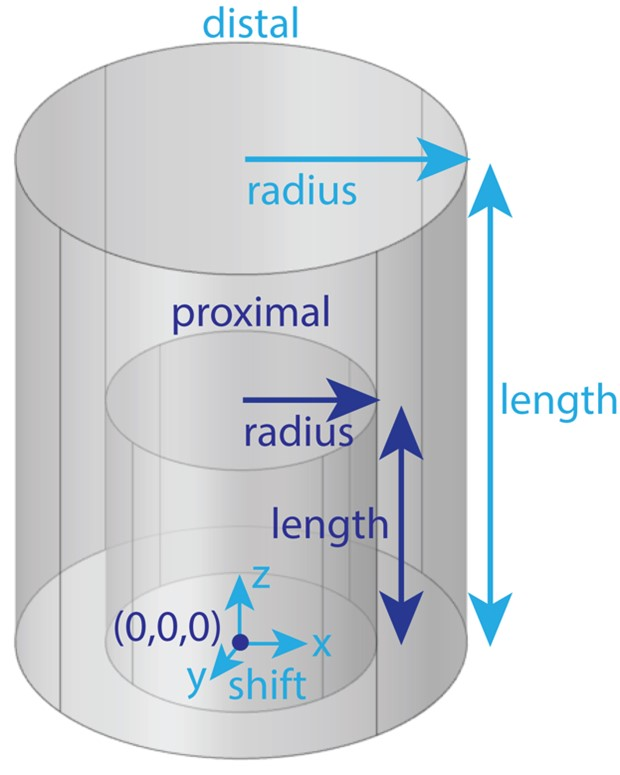

# S25: Control of medium surrounding nerve and cuff electrode
The medium surrounding the nerve and cuff electrode (e.g., fat, skeletal
muscle) must contain a “proximal” domain, which runs the full length of
the nerve, and may optionally include a “distal” domain. The
parameterization for the geometry of the “proximal” and “distal” domains
is shown below in Figure A. For details on how to define the
“proximal” and “distal” domain geometries and meshing parameters, see
`model.json` in [S8 Text](S8-JSON-file-parameter-guide).

Figure A. The user must define a “proximal” domain, and may optionally define a “distal” domain for independent assignment of meshing parameters for the site of stimulation from the rest of the FEM. The “proximal” domain runs the full length of the nerve and is anchored at (0,0,0). The distal domain’s radius and length may be independently assigned, and the entire distal domain may be shifted (“shift”: (x, y, z)). Having a proximal domain that is overly voluminous can significantly decrease COMSOL meshing efficiency and even, rarely, cause errors. At all costs, avoid having a proximal or distal domain whose boundary intersects with a geometry (other than the nerve ends, which are by definition at the longitudinal boundaries of the proximal domain) or the boundary of other geometries (e.g., the cuff-nerve boundary); this will likely create a meshing error.
