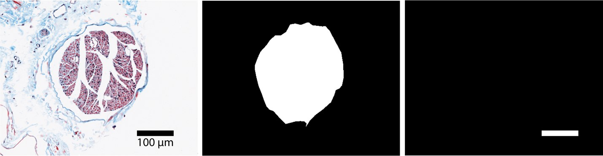
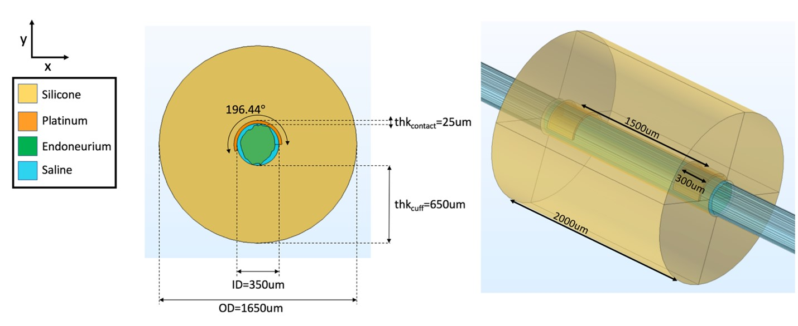
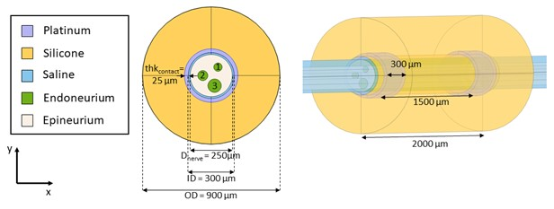
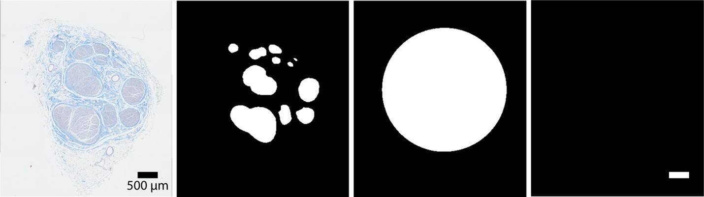
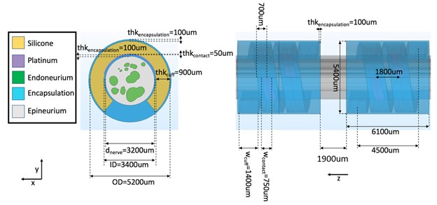
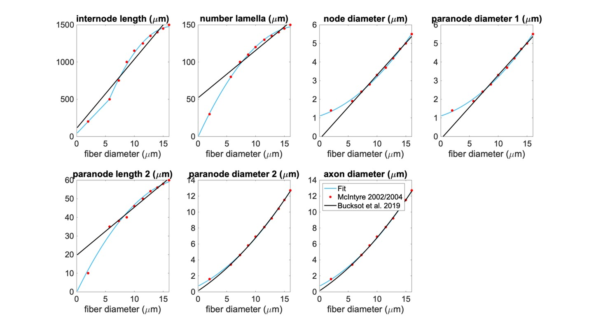
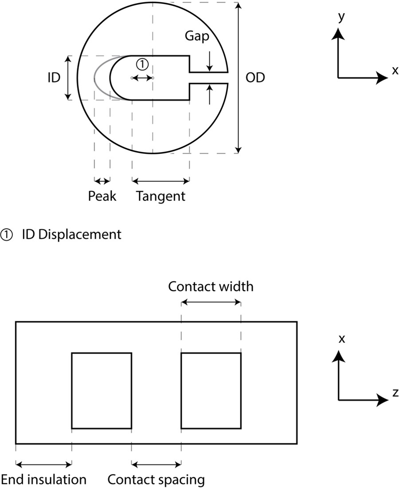
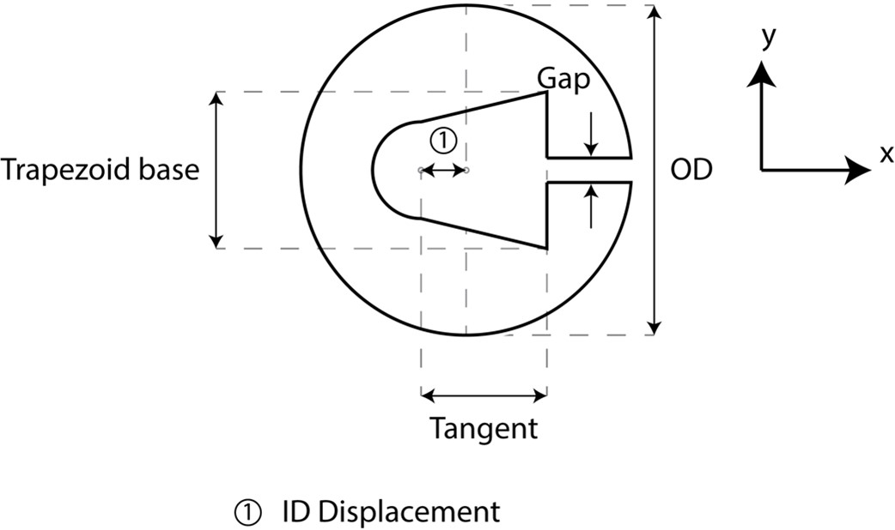

# ASCENT Validation

## Sim4Life validation

We designed test simulations to verify ASCENT’s activation thresholds.
The verifications were performed by The Foundation for Research
Technologies in Society (IT’IS) with the
[Sim4Life](https://zmt.swiss/sim4life/)
(Zurich, Switzerland) simulation platform. Running the following
simulations required modification of the Sim4Life solver to implement
the required electrical anisotropy of tissue conductivities and the
boundary condition to represent the thin layer approximation used to
model the perineurium.

### Monofascicular rat nerve model

We validated activation thresholds for fibers seeded in a model of a rat
cervical vagus nerve instrumented with a bipolar cuff electrode (Figure A and B).

Figure A. Raw histology image (r.tif), segmented histology (i.tif), and scalebar (s.tif) of a rat cervical vagus nerve sample that served as inputs to define the cross-section of the nerve in the FEM.

Figure B. FEM of a rat cervical vagus nerve sample instrumented with a bipolar cuff electrode.

The conductivity values applied to the rat cervical FEM are provided in
Table A, and the boundary conditions applied are provided in
Table B.

Table A. Conductivity values for FEM of rat cervical vagus nerve. These values
were also used in multifascicular nerve model and human model
verifications.

<table border="1" style="padding:5px">
<thead>
<tr class="header">
<th><strong>Parameter</strong></th>
<th><strong>Application</strong></th>
<th><strong>Resistivity</strong> Ω-m</th>
</tr>
</thead>
<tbody>
<tr class="odd">
<td align="center"style="vertical-align:middle" >Endoneurium</td>
<td align="center"style="vertical-align:middle" >Within each fascicle</td>
<td align="center"style="vertical-align:middle" >
1.75 longitudinal

6 radial (rat and human)

12 radial (multifascicular dummy model)
</td>
</tr>
<tr class="even">
<td align="center"style="vertical-align:middle" >Saline</td>
<td align="center"style="vertical-align:middle" >Cylindrical shell between the nerve and cuff</td>
<td align="center"style="vertical-align:middle" >1/1.76</td>
</tr>
<tr class="odd">
<td align="center"style="vertical-align:middle" >Platinum</td>
<td align="center"style="vertical-align:middle" >For both contacts</td>
<td align="center"style="vertical-align:middle" >1/(9.43*106)</td>
</tr>
<tr class="even">
<td align="center"style="vertical-align:middle" >Silicone</td>
<td align="center"style="vertical-align:middle" >For electrode body</td>
<td align="center"style="vertical-align:middle" >1012</td>
</tr>
<tr class="odd">
<td align="center"style="vertical-align:middle" >Muscle</td>
<td align="center"style="vertical-align:middle" >Used for the surrounding "medium": Everything outside of the nerve and cuff, other than the saline layer between the nerve and cuff</td>
<td align="center"style="vertical-align:middle" >
1/0.35 longitudinal

1/0.086 radial
</td>
</tr>
<tr class="even">
<td align="center"style="vertical-align:middle" >Epineurium</td>
<td align="center"style="vertical-align:middle" >Within the nerve around each fascicle</td>
<td align="center"style="vertical-align:middle" >6.3</td>
</tr>
<tr class="odd">
<td align="center"style="vertical-align:middle" >Encapsulation</td>
<td align="center"style="vertical-align:middle" >Between cuff and nerve, and immediately surrounding cuff</td>
<td align="center"style="vertical-align:middle" >6.3</td>
</tr>
</tbody>
</table>

Table B. Boundary conditions used in FEM of rat cervical vagus nerve,
multifascicular dummy nerve, and human cervical vagus nerve.

<table border="1" style="padding:5px">
<thead>
<tr class="header">
<th><strong>Parameter</strong></th>
<th><strong>Setting</strong></th>
</tr>
</thead>
<tbody>
<tr class="odd">
<td align="center"style="vertical-align:middle" >Current conservation</td>
<td align="center"style="vertical-align:middle" >All domains</td>
</tr>
<tr class="even">
<td align="center"style="vertical-align:middle" >Initial condition</td>
<td align="center"style="vertical-align:middle" >V=0 (all domains)</td>
</tr>
<tr class="odd">
<td align="center"style="vertical-align:middle" >Perineurium (sides of each fascicle)</td>
<td align="center"style="vertical-align:middle" >
Modeled as contact impedance

1149 Ω-m * 0.03 * dfasc[m]
</td>
</tr>
<tr class="even">
<td align="center"style="vertical-align:middle" >Ground (all outer boundaries of the model)</td>
<td align="center"style="vertical-align:middle" >V = 0</td>
</tr>
<tr class="odd">
<td align="center"style="vertical-align:middle" >Point current source (one in each contact)</td>
<td align="center"style="vertical-align:middle" >
-1 mA

<ul>

1 mA
</td>
</ul></td>
</tr>
</tbody>
</table>

We compared thresholds for 100 5.7 µm myelinated axons (MRG model)
seeded in the cross-section of the nerve in response to a single 100 µs
duration monophasic rectangular pulse. The differences in thresholds
between ASCENT and IT’IS model implementations was \<4.2% for all
fibers, demonstrating strong agreement (Figure C).

Figure C. Comparison of activation thresholds for the rat cervical vagus nerve implementation in ASCENT and Sim4Life.

### Multifascicular dummy nerve model

We validated activation thresholds for fibers seeded in a
multifascicular dummy nerve instrumented with a bipolar cuff electrode
(Figure D and E). The segmented histology was created using
our `mock_morphology_generator.py` script ([Mock Morphology](MockSample)).

Figure D. Mock morphology inputs to the define tissue boundaries for a multifascicular dummy nerve for validation with Sim4Life. Scale bar is 100 µm long. The nerve is a perfect circle (diameter = 250 µm, centered at (x,y)=(0,0) µm). The inners are also perfect circles: (1) diameter = 50 µm, centered at (x,y)=(40,50) µm, (2) diameter = 60 µm, centered at (x,y)=(-50,0) µm, and (3) diameter = 80 µm, centered at (x,y)=(20,-60) µm.

Figure E. FEM of a multifascicular nerve sample instrumented with a bipolar cuff electrode.

The conductivity values applied to multifascicular nerve sample finite
element model are provided in Table A, and the boundary conditions
applied are provided in Table B.

We seeded a single 5.7 µm diameter fiber in the center of each fascicle.
Between the ASCENT and IT’IS implementations, there was less than a 3%
difference in threshold to a single 100 µs duration monophasic
rectangular pulse.

### Multifascicular human nerve model

We validated activation thresholds for fibers seeded in a
multifascicular human cervical vagus nerve instrumented with a LivaNova
bipolar cuff electrode (Figure F and G). The segmented
histology was created using Nikon NIS-Elements.

Figure F. Raw histology image (r.tif), segmented inners (i.tif), segmented nerve (n.tif), and scale bar (s.tif) of a human cervical vagus nerve sample that served as inputs to define the cross-section of the nerve in the FEM for validation with Sim4Life.

Figure G. FEM of a human cervical vagus nerve sample instrumented with a LivaNova cuff electrode.

The conductivity values applied to the human cervical vagus nerve sample
finite element model are provided in Table A, and the boundary
conditions applied are provided in Table B.

We seeded 5.7 µm diameter fibers in each fascicle. Between the ASCENT
and IT’IS implementations, there was less than 2.5% difference to a
single 100 µs duration monophasic rectangular pulse.

## Comparison of MRG fit to Bucksot 2019

### Comparison of MRG fit to Bucksot et al. 2019

Figure A. Our piecewise polynomial fits to published MRG fiber parameters compared to the Bucksot et al. 2019’s interpolation {cite:p}`Bucksot2019`. Single quadratic fits were used for all parameters except for internode length, which has a linear fit below 5.643 µm (using MRG data at 2 and 5.7 µm) and a single quadratic fit at diameters greater than or equal to 5.643 µm (using MRG data >= 5.7 µm); 5.643 µm is the fiber diameter at which the linear and quadratic fits intersected. The fiber diameter is the diameter of the myelin. "Paranode 1" is the MYSA section, "paranode 2" is the FLUT section, and "internode" is the STIN section. The axon diameter is the same for the node of Ranvier and MYSA ("node diameter"), as well as for the FLUT and STIN ("axon diameter"). The node and MYSA lengths are fixed at 1 and 3 μm, respectively, for all fiber diameters.

## Micro Leads cuff measurements

We collected and measured images of 200, 300, and 400 µm Micro-Leads
Neuro cuffs (Somerville, MA) (Figure A and Table A).

Figure A. Micro-Leads cuff measurements taken for 200, 300, and 400 µm inner diameter cuffs. Inner diameter (ID) displacement is defined from the center of the circle of the outer diameter (OD) to the center of the semicircle for the inner diameter.

Table A. Cuff measurements (units: micrometer) for 200, 300, and 400 µm inner diameter Micro-Leads cuffs.

<table class="tg" border="1" style="padding:5px">
<thead>
  <tr>
    <th colspan="8" class="tg-0lax">Cross-Sectional Measurements</th>
    <th colspan="3" class="tg-0lax">Longitudinal Measurements</th>
  </tr>
</thead>
<tbody>
  <tr>
    <td align="center"style="vertical-align:middle" class="tg-0lax">Cuff</td>
    <td align="center"style="vertical-align:middle" class="tg-0lax"># cuff measured</td>
    <td align="center"style="vertical-align:middle" class="tg-0lax">OD</td>
    <td align="center"style="vertical-align:middle" class="tg-0lax">ID</td>
    <td align="center"style="vertical-align:middle" class="tg-0lax">ID Displacement (x)</td>
    <td align="center"style="vertical-align:middle" class="tg-0lax">Peak (x)</td>
    <td align="center"style="vertical-align:middle" class="tg-0lax">Tangent (x)</td>
    <td align="center"style="vertical-align:middle" class="tg-0lax">Gap (y)</td>
    <td align="center"style="vertical-align:middle" class="tg-0lax">End Insulation</td>
    <td align="center"style="vertical-align:middle" class="tg-0lax">Contact Width</td>
    <td align="center"style="vertical-align:middle" class="tg-0lax">Contact Spacing</td>
  </tr>
  <tr>
    <td align="center"style="vertical-align:middle" class="tg-0lax">200 &mu;m</td>
    <td align="center"style="vertical-align:middle" class="tg-0lax">6 bipolar</td>
    <td align="center"style="vertical-align:middle" class="tg-0lax">1080</td>
    <td align="center"style="vertical-align:middle" class="tg-0lax">210</td>
    <td align="center"style="vertical-align:middle" class="tg-0lax">135</td>
    <td align="center"style="vertical-align:middle" class="tg-0lax">15</td>
    <td align="center"style="vertical-align:middle" class="tg-0lax">175</td>
    <td align="center"style="vertical-align:middle" class="tg-0lax">30</td>
    <td align="center"style="vertical-align:middle" class="tg-0lax">295</td>
    <td align="center"style="vertical-align:middle" class="tg-0lax">590</td>
    <td align="center"style="vertical-align:middle" class="tg-0lax">305</td>
  </tr>
  <tr>
    <td align="center"style="vertical-align:middle" class="tg-0lax">300 &mu;m</td>
    <td align="center"style="vertical-align:middle" class="tg-0lax">12 bipolar, 2 tripolar</td>
    <td align="center"style="vertical-align:middle" class="tg-0lax">1190</td>
    <td align="center"style="vertical-align:middle" class="tg-0lax">265</td>
    <td align="center"style="vertical-align:middle" class="tg-0lax">130</td>
    <td align="center"style="vertical-align:middle" class="tg-0lax">30</td>
    <td align="center"style="vertical-align:middle" class="tg-0lax">255</td>
    <td align="center"style="vertical-align:middle" class="tg-0lax">40</td>
    <td align="center"style="vertical-align:middle" class="tg-0lax">415</td>
    <td align="center"style="vertical-align:middle" class="tg-0lax">680</td>
    <td align="center"style="vertical-align:middle" class="tg-0lax">390</td>
  </tr>
  <tr>
    <td align="center"style="vertical-align:middle" class="tg-0lax">400 &mu;m</td>
    <td align="center"style="vertical-align:middle" class="tg-0lax">4 bipolar</td>
    <td align="center"style="vertical-align:middle" class="tg-0lax">1605</td>
    <td align="center"style="vertical-align:middle" class="tg-0lax">465</td>
    <td align="center"style="vertical-align:middle" class="tg-0lax">325</td>
    <td align="center"style="vertical-align:middle" class="tg-0lax">0</td>
    <td align="center"style="vertical-align:middle" class="tg-0lax">200</td>
    <td align="center"style="vertical-align:middle" class="tg-0lax">35</td>
    <td align="center"style="vertical-align:middle" class="tg-0lax">535</td>
    <td align="center"style="vertical-align:middle" class="tg-0lax">745</td>
    <td align="center"style="vertical-align:middle" class="tg-0lax">475</td>
  </tr>
</tbody>
</table>

We also collected and measured images of 100 µm Micro-Leads cuffs, which
had a different cross-section from the larger diameter cuffs and are
therefore reported separately (Figure B and Table B).

Figure B. Micro-Leads cuff measurements taken for 100 µm inner diameter cuffs. Inner diameter (ID) displacement is defined from the center of the circle of the outer diameter (OD) to the center of the semicircle for the inner diameter.

Table B. Cuff measurements (units: micrometer) for 100 µm inner diameter Micro-Leads cuffs.

<table class="tg" border="1" style="padding:5px">
<thead>
  <tr>
    <th colspan="8" class="tg-0lax">Cross-Sectional Measurements</th>
    <th colspan="3" class="tg-0lax">Longitudinal Measurements</th>
  </tr>
</thead>
<tbody>
  <tr>
    <td align="center"style="vertical-align:middle" class="tg-0lax">Cuff</td>
    <td align="center"style="vertical-align:middle" class="tg-0lax"># cuff measured</td>
    <td align="center"style="vertical-align:middle" class="tg-0lax">OD</td>
    <td align="center"style="vertical-align:middle" class="tg-0lax">ID</td>
    <td align="center"style="vertical-align:middle" class="tg-0lax">Trapezoid Base</td>
    <td align="center"style="vertical-align:middle" class="tg-0lax">Tangent (x)</td>
    <td align="center"style="vertical-align:middle" class="tg-0lax">Gap (y)</td>
    <td align="center"style="vertical-align:middle" class="tg-0lax">ID Displacement (x)</td>
    <td align="center"style="vertical-align:middle" class="tg-0lax">End Insulation</td>
    <td align="center"style="vertical-align:middle" class="tg-0lax">Contact Width</td>
    <td align="center"style="vertical-align:middle" class="tg-0lax">Contact Spacing</td>
  </tr>
  <tr>
    <td align="center"style="vertical-align:middle" class="tg-0lax">200 &mu;m</td>
    <td align="center"style="vertical-align:middle" class="tg-0lax">6</td>
    <td align="center"style="vertical-align:middle" class="tg-0lax">1060</td>
    <td align="center"style="vertical-align:middle" class="tg-0lax">125</td>
    <td align="center"style="vertical-align:middle" class="tg-0lax">200</td>
    <td align="center"style="vertical-align:middle" class="tg-0lax">85</td>
    <td align="center"style="vertical-align:middle" class="tg-0lax">30</td>
    <td align="center"style="vertical-align:middle" class="tg-0lax">210</td>
    <td align="center"style="vertical-align:middle" class="tg-0lax">180</td>
    <td align="center"style="vertical-align:middle" class="tg-0lax">320</td>
    <td align="center"style="vertical-align:middle" class="tg-0lax">150</td>
  </tr>
</tbody>
</table>

For all "preset" cuff JSON files based on our Micro-Leads cuff
measurements, we recessed the contacts by 50 µm. Though we were not able
to directly measure the recess depth of the contacts, Micro-Leads
informed us that the surface of the electrode metal could never be
recessed by more than \~60-70 µm.
