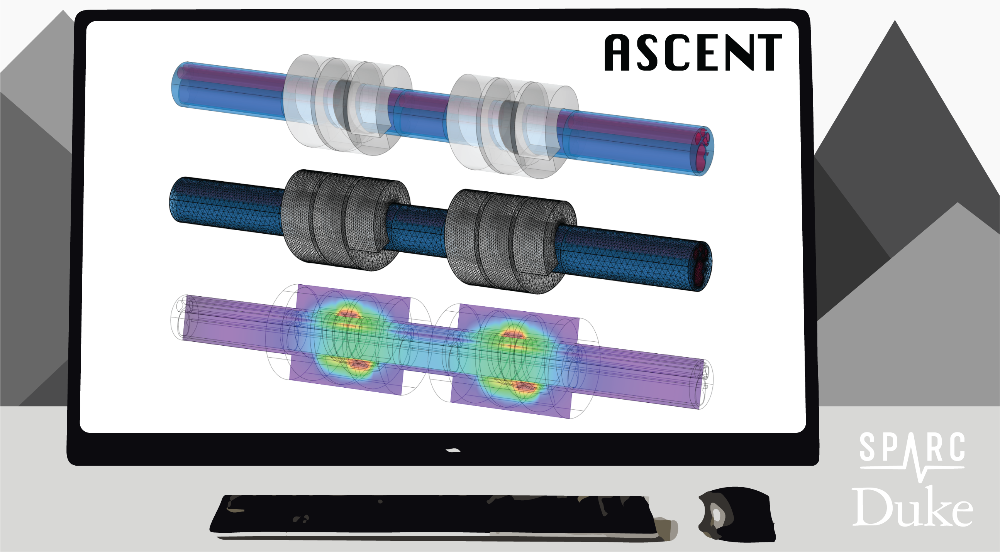

.. ASCENT documentation master file, created by
   sphinx-quickstart on Fri Sep 17 12:12:45 2021.
   You can adapt this file completely to your liking, but it should at least
   contain the root `toctree` directive.

.. |doi| image:: https://zenodo.org/badge/379064819.svg
   :target: https://zenodo.org/badge/latestdoi/379064819

Welcome to ASCENT's documentation!
==================================
**Please check out the associated** `publication <https://doi.org/10.1371/journal.pcbi.1009285>`_ **in PLOS Computational Biology!**

Cite both the paper and the DOI for the release of the repository used for your work. We encourage you to clone the most recent commit of the repository.

**Cite the paper:**

**Musselman ED**, **Cariello JE**, Grill WM, Pelot NA. ASCENT (Automated Simulations to Characterize Electrical Nerve Thresholds): A Pipeline for Sample-Specific Computational Modeling of Electrical Stimulation of Peripheral Nerves. PLoS Comput Biol [Internet]. 2021; Available from: https://doi.org/10.1371/journal.pcbi.1009285

**Cite the code (use the DOI for the version of code used):** |doi|

**Musselman ED**, **Cariello JE**, Grill WM, Pelot NA. ASCENT (Automated Simulations to Characterize Electrical Nerve Thresholds): A Pipeline for Sample-Specific Computational Modeling of Electrical Stimulation of Peripheral Nerves. PLoS Comput Biol [Internet]. 2021, DOI: 10.5281/zenodo.5500260

**ASCENT** is an open source platform for simulating peripheral nerve stimulation. To download the software, visit the `ASCENT GitHub repository <https://github.com/wmglab-duke/ascent>`_.

.. toctree::
   :maxdepth: 2
   :caption: Contents:

   S1-Metadata-required-to-model-an-in-vivo-experiment-using-the-ASCENT-pipeline
   S2-Installation
   S3-ASCENT-data-hierarchy
   S4-Your-first-run
   S5-Template-for-methods-reporting
   S6-Enums
   S7-JSON-configuration-files
   S8-JSON-file-parameter-guide
   S9-Python-utility-classes
   S10-Submitting-NEURON-jobs
   S11-Morphology-files
   S12-Python-MockSample-class-for-creating-binary-masks-of-nerve-morphology
   S13-Python-classes-for-representing-nerve-morphology-(Sample)
   S14-Creating-sample-specific-nerve-morphologies-in-COMSOL
   S15-Micro-Leads-cuff-measurements
   S16-Library-of-part-primitives-for-electrode-contacts-and-cuffs
   S17-Creating-custom-preset-cuffs-from-instances-of-part-primitives
   S18-Creating-new-part-primitives
   S19-Cuff-placement-on-nerve
   S20-Fiberset
   S21-Implementation-of-NEURON-fiber-models
   S22-Simulation-protocols
   S23-ModelWrapper-class
   S24-Making-geometries-in-COMSOL-(Part-class)
   S25-Control-of-medium-surrounding-nerve-and-cuff-electrode
   S26-Java-utility-classes
   S27-Defining-and-assigning-materials-in-COMSOL
   S28-Definition-of-perineurium
   S29-Data-interchange-between-COMSOL-and-NEURON
   S30-Python-simulation-class
   S31-NEURON-launch.hoc
   S32-NEURON-Wrapper.hoc
   S33-Data-analysis-tools
   S34-Convergence-analysis-example
   S35-Sim4Life-validation
   S36-Comparison-of-MRG-fit-to-Bucksot-2019
   Paper-References
